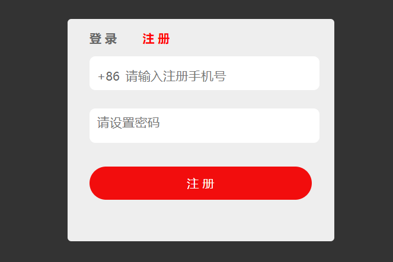
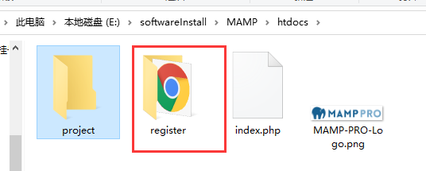
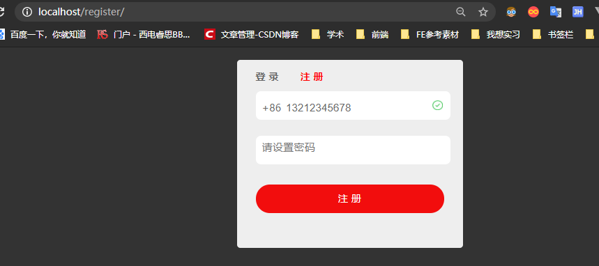

# Ajax实例 - 检测用户与注册


## 检测用户名是否被占用

**Ajax做了什么？**

用户输入用户名，ajax异步发送请求检测用户是否存在，然后再进行注册。



编写样式和内容完毕后开始编写脚本：

### ajax调用

jQuery封装的ajax请求，其调用如下：

```js
$.ajax({
  url:"http://sd127.1232/study.php",
  method:"POST",
  async:true,
  data:{username:12324242,pasword:"efwe"},
  // dataType,
  success:function(){
  },
  error:function(){
  }
}
```

### 封装ajax请求

我们模仿jquery来封装自己的ajax请求

```js
var $ = {
  ajax: function (options) {
    var xhr = null,          // XMLHttpRequest对象
      url = options.url,   // url地址
      method = options.method || 'get', // 传输方式，默认为get
      async = typeof (options.async) === "undefined" ? true : options.async,
      data = options.data || null,      // 参数
      params = '',
      callback = options.success,       // ajax请求成功的回调函数                   
      error = options.error;
    // 将data的对象字面量的形式转换为字符串形式
    if (data) {
      for (var i in data) {
        params += i + '=' + data[i] + '&';
      }
      params = params.replace(/&$/, "");
    }
    // 根据method的值改变url
    if (method === "get") {
      url += '?' + params;
    }
    if (typeof XMLHttpRequest != "undefined") {
      xhr = new XMLHttpRequest();
    } else if (typeof ActiveXObject != "undefined") {
      // 将所有可能出现的ActiveXObject版本放在一个数组中
      var xhrArr = ['Microsoft.XMLHTTP', 'MSXML2.XMLHTTP.6.0', 'MSXML2.XMLHTTP.5.0', 'MSXML2.XMLHTTP.4.0', 'MSXML2.XMLHTTP.3.0', 'MSXML2.XMLHTTP.2.0'];
      // 遍历创建XMLHttpRequest对象
      var len = xhrArr.length;
      for (var i = 0; i < len; i++) {
        try {
          // 创建XMLHttpRequest对象
          xhr = new ActiveXObject(xhrArr[i]);
          break;
        }
        catch (ex) {

        }
      }
    } else {
      throw new Error('No XHR object availabel.');
    }
    xhr.onreadystatechange = function () {
      if (xhr.readyState === 4) {
        if ((xhr.status >= 200 && xhr.status < 300) || xhr.status === 304) {
          callback && callback(JSON.parse(xhr.responseText));
        } else {
          error && error();
        }
      }
    }
    // 创建发送请求
    xhr.open(method, url, async);
    xhr.setRequestHeader("Content-type", "application/x-www-form-urlencoded");
    xhr.send(params);
  },
  jsonp: function () {
    // 跨域
  }
}

```

## 运行程序

使用MAMP开启服务



然后直接访问localhost就可以进入页面




## 关于表单提交与Ajax

* 表单提交

  ```html
  <form action="test.php" method="post"></form>
  ```

  缺点：会刷新页面，跳转页面

* **Ajax提交（静默提交）**

  优点：不刷新页面，不跳转页面