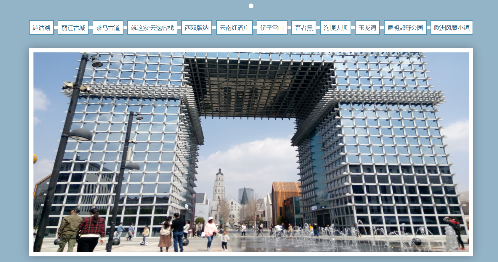

# 实现一个简单相册



## 核心逻辑

点到不同的连接时，其对应的图片透明度为1，其兄弟透明度为0

```js
$(document).ready(function(){
  $('a').click(function(){
    $('img').eq($(this).index())
            .css({'opacity':'1'})
            .siblings()
            .css({'opacity':'0'});
  });
})
```


## 补充知识

```css
display: flex;
justify-content: space-between;
```

这两个属性结合使用可以让元素在容器中左右均匀分布。最常用于移动端开发。

```
vw：//相对单位，1vw等于可视窗口宽度的1%

vh：//相对单位，1vw等于可视窗口高度的1%
```

