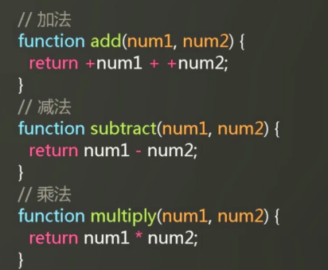

# JS实现简易计算器案例

案例比较简单，重点看每一次修改代码的思路。

# 1 案例介绍

***


# 2 结构和样式

***


# 3 添加JS功能

***

最常见的思路：

首先获取到元素


定义按钮的绑定事件


 但这样的将结构，样式和行为糅杂在了一起，style和script都应该作为单独的文件引入进来。

# 4 代码改进

***

## 4.1 第一次修改：结构和行为分离

不是为`input`定义`onclick`函数这样内嵌的方式。


而是获取元素后为他们添加事件，为他们添加一个统一的class:btn


从而可以通过class获取到btn


然后对btn进行绑定事件，直接传入函数名


## 4.2 第二次修改：使用循环


对数组的操作应该通过循环来一次性实现。

获取元素部分不变，改写绑定事件，在这里使用匿名函数判断到底给该按钮绑定哪个事件。

首先修改html，为btn添加属性title


然后再匿名函数中通过switch-case判断


## 4.3 第三次修改：提取函数

我们可以将for循环封装起来


对于这里对html结构的更新，都可以封装成函数来进行调用，一个函数一般做一件事情比较好，但是例如这一行，我们做了两件事情：计算+赋值，可以将他提取成函数。


首先更改for循环，写一个回调函数


调用each来循环for数组


对于某个具体计算我们可以分为两步

第一步，更新符号


第二步 计算过程



第三步 输出结果


最后改写给btns绑定的事件


到现在把函数都提取了出来

## 4.4 第四次修改：管理代码

对于获取元素这里


代码很多，而且都是全局变量不便于管理，其实可以发现他们之间有联系，calculator是计算器的父元素，其他的变量都与它有关，让其作为一个对象的属性就可以

上述代码修改为


这里的计算的小函数很多，不方便管理，所有我们也要为它找到一个组织，可以创建一个对象，对其进行管理，


改为


其他代码进行相应的修改 

## 4.5 第五次修改：开放与封闭原则

> 代码原则：OCP原则（Open Closed Principle）开放与封闭原则

在这里，就是对**添加功能开放，对修改代码封闭**

可以看到，对每一个处理函数，里面都进行了updateSign操作


可以改为通过input的value来一次性传，不用每次手动传符号。不用处理函数了。


这里用的switch，swtich是糟糕代码的开始，尽量少使用swtich。

现在有四个按钮，如果想添加别的按钮，例如增加一个求模

```html
<input type="button" value="%" class="btn" title="mod" />
```

就要再switch里面添加一个case


然后在operation里添加mod方法

 

每一次增加新功能，要输入内部修改原有代码。这样有安全风险。

开发对增加新功能开放，但是不能到原有的代码里面去修改，应该由暴漏在外的接口来修改。

对于有几十种计算的需求，不可能在case中使用几十个case来判断。所以这里应该修改掉switch。可以看到，在switch里无非是将add对应到operation的add方法，subtract对应到operation里的subtract方法。


可以改写一个为运算方法`function operate(name,num1,num2)`

首先判断是否存在该方法，然后再进行运算

```js
  //运算
  function operate(name,num1,num2){
    if(!operation[name]) throw new Error('不存在名为'+name+'的运算方法！');
    return operation[name](num1,num2);
  }
```

```js
  //绑定事件
  each(calculatorElem.btns, function (index, elem) {
    elem.onclick = function () {
      updateSign(this.value);//this指代相应的btns[i]
  outputResult(operate(this.title,calculatorElem.formerInput.value,calculatorElem.laterInput.value));
    };
  });
```

这样就去掉了switch方法。

对于operation里面的操作，我们直接定义一个函数来新增运算方法

```js
 var operation = {
    add: function (num1, num2) {
      return +num1 + +num2;
    },
    subtract: function (num1, num2) {
      return num1 - num2;
    },
    multiply: function (num1, num2) {
      return num1 * num2;
    },
    divide: function (num1, num2) {
      return num1 / num2;
    },
     //新增运算方法
    addOperation:function(name,fn){
      if(!this[name]){
        this[name]=fn;//判断有没有重名，防止覆盖到之前的方法
      }
      return this;//return this 使得可以链式调用
    }
  };
```

这样如果想要新增功能的话就可以直接调用`addOperation`

```js
  //如何增加新功能
  operation.addOperation('mod',function(num1,num2){
    return num1 % num2;
  }).addOperation('power',function(base,power){
    return Math.pow(base,power)
  });
```

## 4.6 第六次修改：模块化

这里实现的是一个计算器的功能，如果在网站中使用它，可以将其作为一个计算器的模块。


像是这里，暴露了一些全局变量，并不关心这些变量，只想要能调用计算器这个模块就可以，这些变量反而会污染全局作用域。最好是这个代码既可以执行，又可以放到外面的局部作用域上，与其他模块互不干扰。

将其作为一个匿名函数自执行，这样该计算器里面的变量都变成了局部变量，当匿名函数执行完毕之后，里面的变量也都会被释放，因为局部作用域会被销毁。


将其模块化后，适当将其中的接口暴露。


可以看到这两部分的核心功能就是接受参数进行计算，然后返回结果。这是一个比较独立的功能，可以做成一个模块，可以使用匿名函数自执行的方法进行封装。


再来看进行运算的时候，参数不一定是两个，例如求ln，求倒数，都只有一个参数，可以使用argument来进行参数传递。


# 5 修改与建议 

***


