# Node.js基础

[toc]

# ch1 课程介绍

## 1-1 课程简介

**为什么要学Node？**

* 使自己更全面，有大局观
* 提升话语权

**Node的作用和应用**

* 脱离浏览器运行JS
* 后台API编写
* Webpack，Gulp，Npm等等都强依赖于node
* 中间层：服务器中负责IO读写的中间服务器

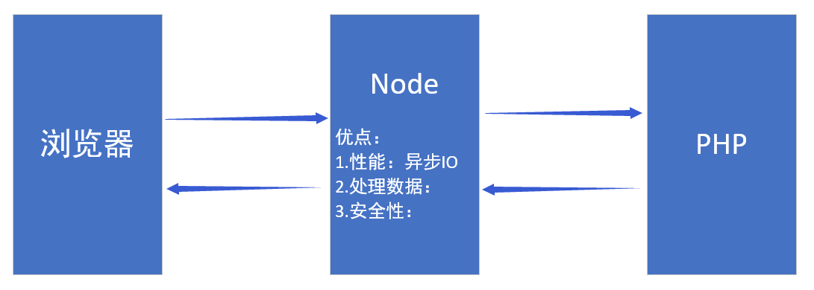

## 1-2 学习目标

一个小案例：**登录，注册案例**

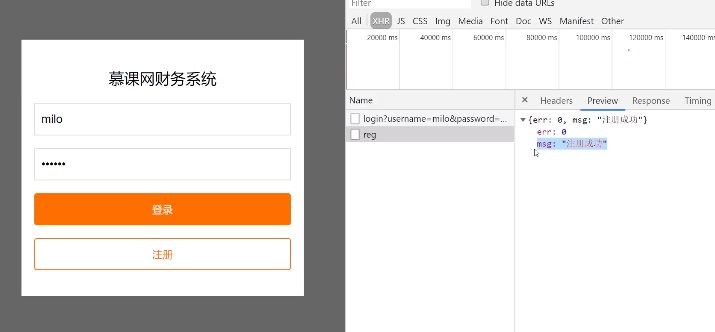

# ch2 Node介绍

## 2-1 Node的优势

**Node的优点**

* 便于前端开发入门
* 性能高
* 利于前端代码整合

**Node缺点**

* 无太多辅助框架(不像java框架很多)

## 2-2 Node环境搭建和运行

早会了

## 2-3 npm和包

早会了

npm init

npm install xxx (简写 npm i xxx)

npm uninstall (npm un xxx)

cnpm

# ch3 Node的模块

## 3-1 Node三大模块：全局模块

* **定义：何时何地都能访问，不需要引用**
* **process.env**：环境变量
* **process.argv**

（还有更多全局模块）

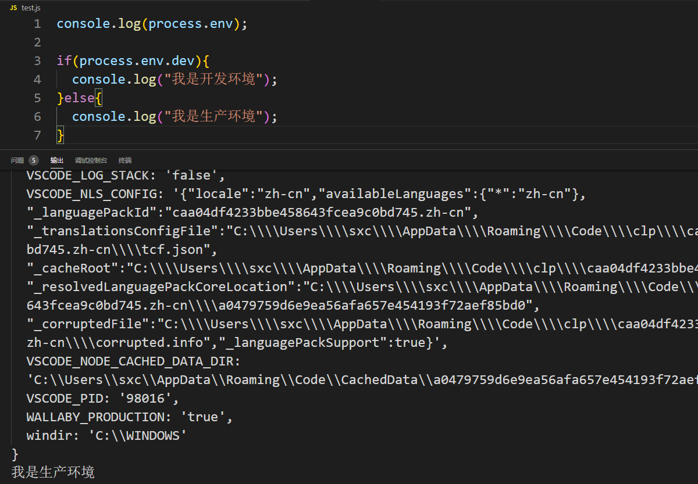

可以接受多个参数

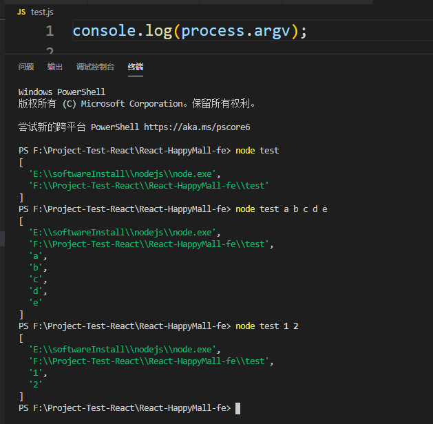

利用接受参数做计算输出

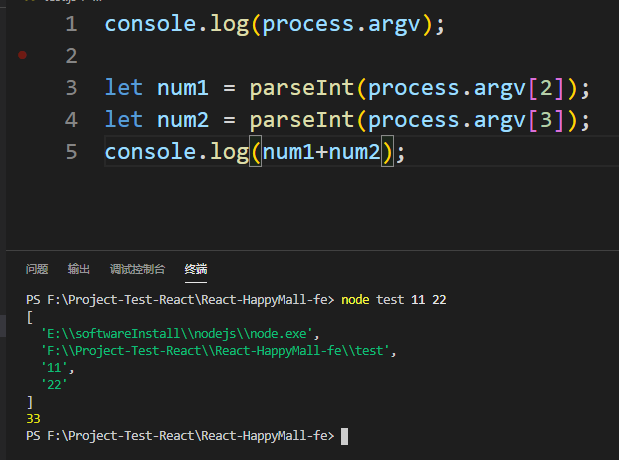

## 3-2 Node三大模块：系统模块

* **定义：需要require()，但不需要单独下载**
* **path：用于处理文件路径和目录路径的实用工具**
* **fs：用于文件读写操作**

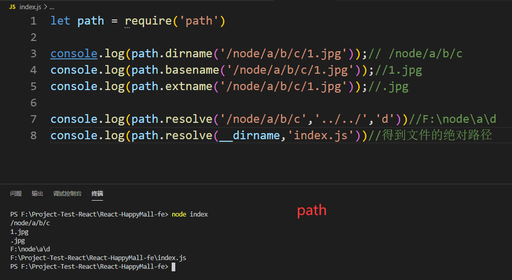

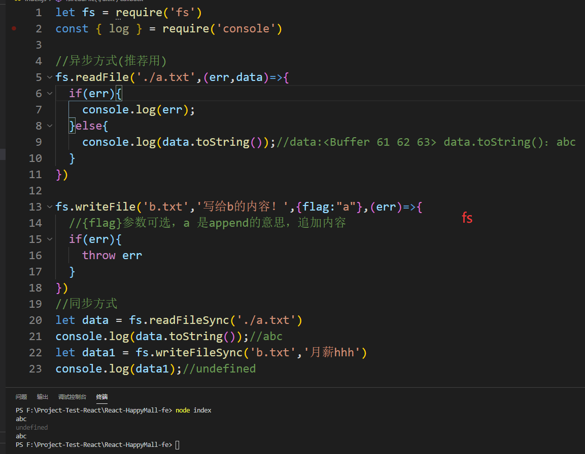

## 3-3 Node三大模块：自定义模块

* **定义：require自己封装的模块**
* **exports**
* **moduel**
* **requie**

require注意的点：

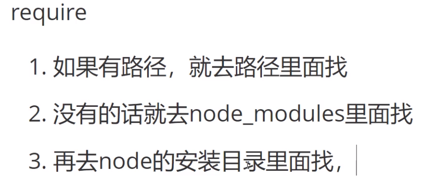

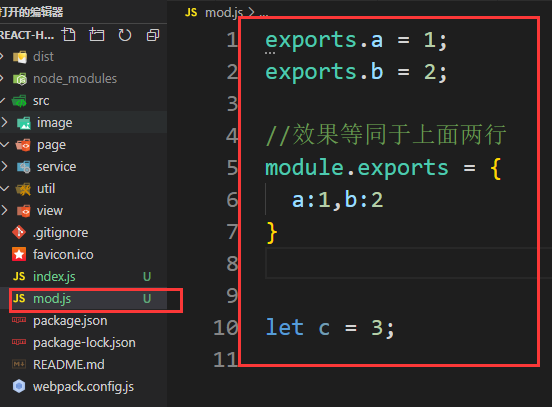

module.exports可以导出对象，function，class等等

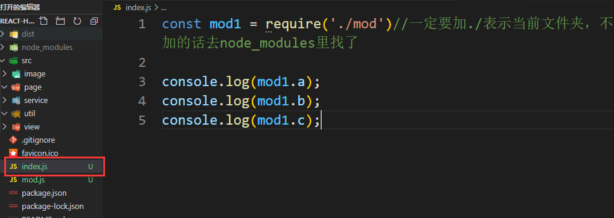

## 3-4 核心：http模块

**服务器对象：http.createServer()**

以下代码搭建一个小型服务器：

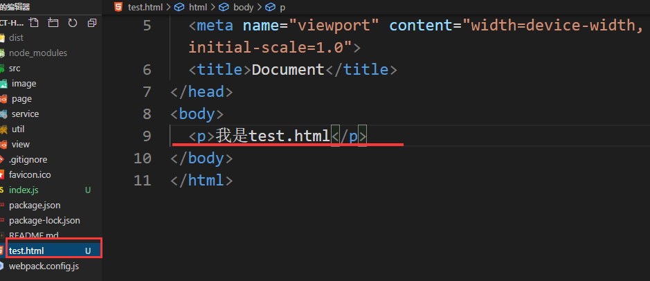

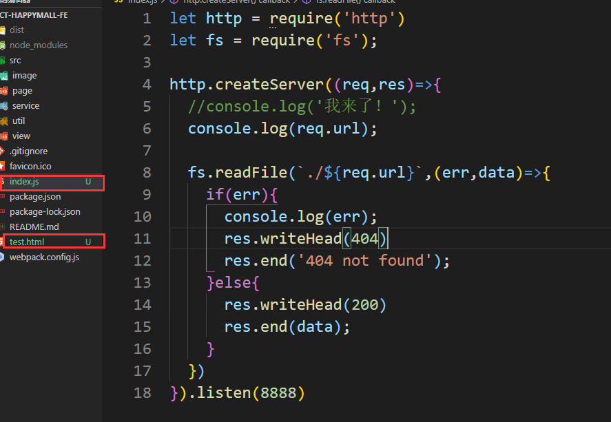

监听端口8888，使用`req.url`判断进入到哪个页面。

使用 `node index`（= node index.js）开启服务。

当访问localhost:8088时

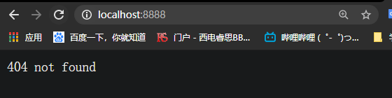

控制台打印出路径 `/`

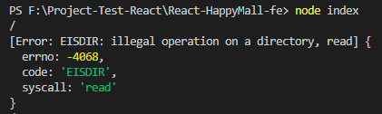

当访问localhost:8080/test.html

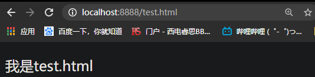

控制台打印出路径 `/test.html`

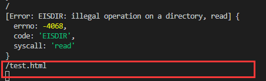

(光标一直闪烁，表示node服务器一直在开启监听)

# ch4 Node中的数据交互

浏览器和服务器相关传输的数据为报文。传输报文包括头和体

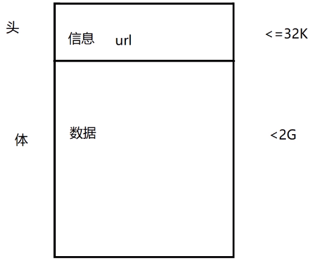

数据交互有很多方式：GET POST DELETE POST...

## 4-1 GET请求

* **什么是GET请求？主要是获取数据**
* **数据是放在url里面进行传输**：url?user=xxx&pass=xxx
* **容量小：<32k**

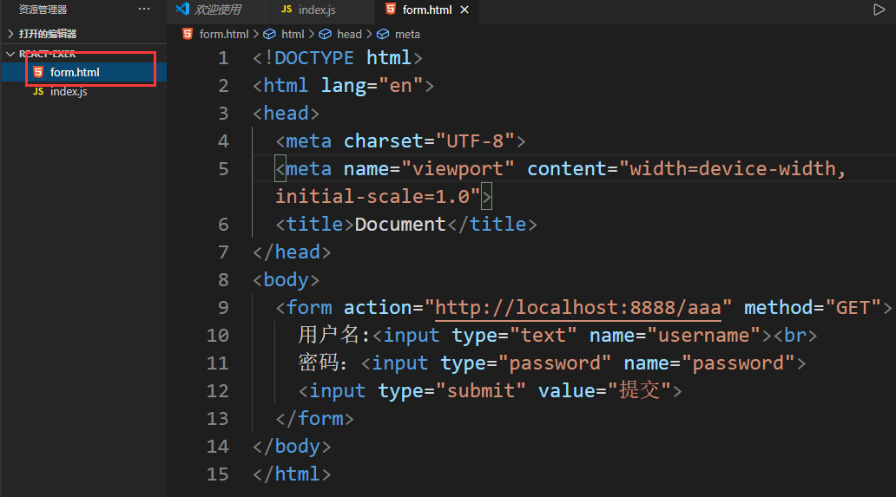

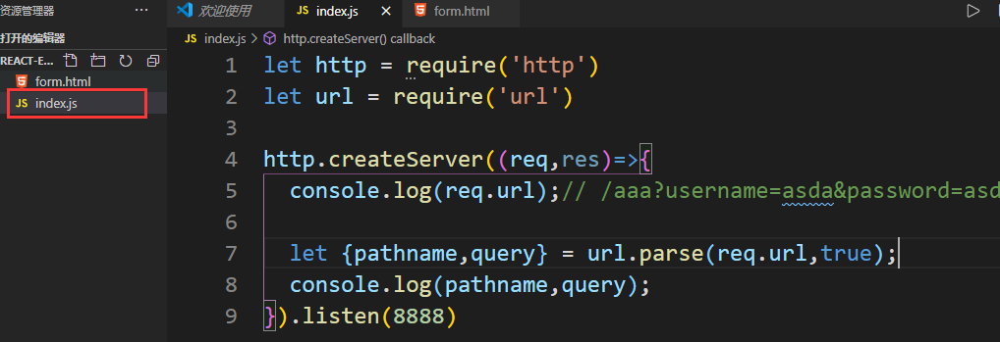

在index.js里借助url模块，通过url.parse处理请求来的req.url

使用`node index`启动服务，当打开form.html并提交表单时

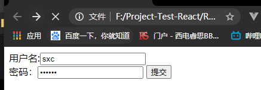

可以看到控制台打印出

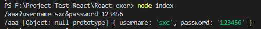

分别打印的时`req.url`,`pathname`,`query`

【注意】：

* 如果打印`url.parse(req.url)`，得到的结果是

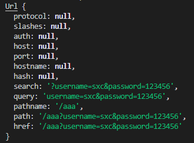

* 如果打印`url.parse(req.url,true)`，得到的结果是

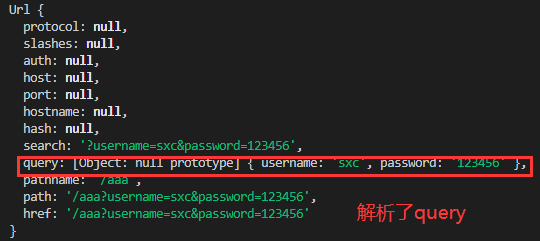

## 4-2 POST请求

* **数据是放在body里面进行传输的**:数据放在请求体里
* **容量大：<2G**
* querystring.parse(data)可以用来处理数据

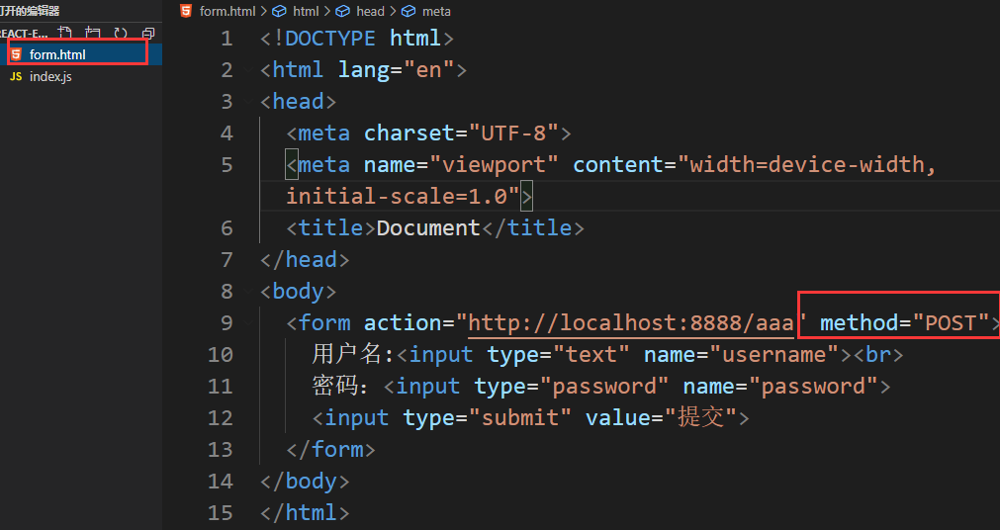

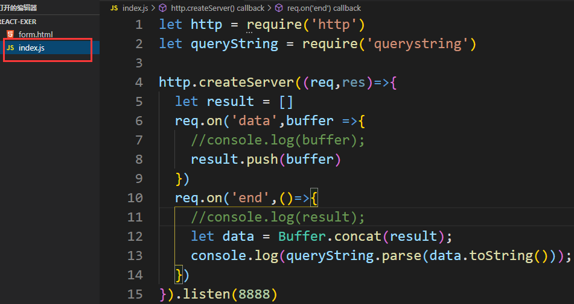

当提交表单后，可以看到打印的结果

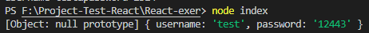

# ch5 案例

## 5-1 接口（API）

**接口设计**

* **什么是接口（API）**：不同功能层之间的通信规则称为接口
* **参数**
* **返回值**

```markdown
1.登录接口设计

'/login'
username,password
get

{
  err:1,
  msg:"密码"
}

2.注册接口设计
'/reg'
post
```


## 5-2 项目：实现登录和注册

自己更改了css样式，具体逻辑代码详见源码

# ch6 课程回顾与总结

## 6-1 总结扩展

**node的作用**

1. 写webAPI
2. 中间层
3. 前端工程化的一些（webpack，gulp）

**nodeJS的优势**

1. 性能高
2. 便于前端入手

**npm**

* package.json管理依赖

**Node三大模块**

1. 全局模块
2. 系统模块：require引入
3. 自定义模块：自己封装 module.export

**重点：http**

```js
http.createServer((req,res)=>{
 //...
})
```

**数据通信**

* **get :**
  * url模块 `url.parse(req.url,true)`

* post:

  * ```js
    let arr = [];
    req.on('data',buffer=>{ 
    	arr.push(buffer)
    })
    
    req.on('end',()=>{
        Buffer.concat(arr).toString();
    })
    ```

  * `querystring.parse(req.url)` //username=zhangsan&password=123

**登录注册案例**

* 接口API
* 设计API
  * 详细看`接口设计.md`

## 6-2 深入，扩展建议

* express/koa2
* MongoDB等