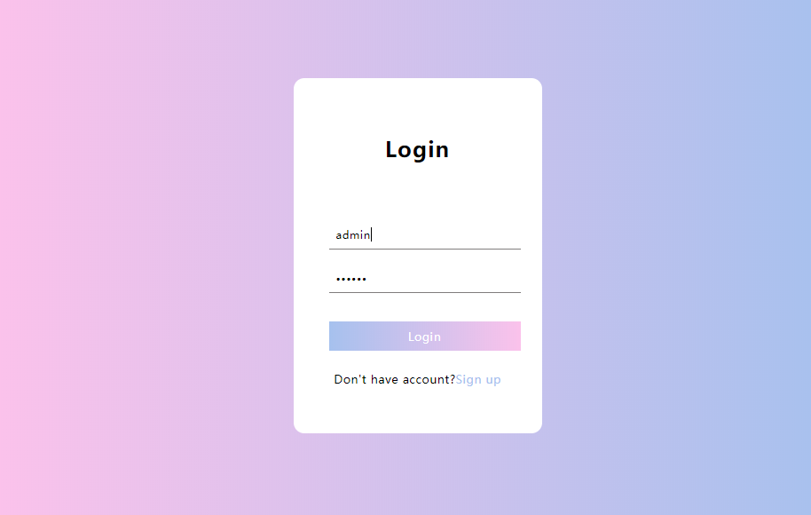
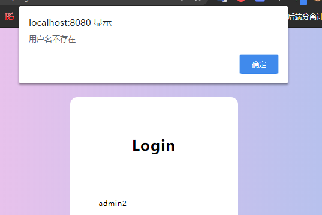

#  一个简单的登录注册页面

使用NodeJS编写后台API接口

初始用户为：

| username | password | note |
| -------- | -------- | ---- |
| admin    | 123456   |      |

**登录时：**

* 判断用户名是否存在
* 用户名存在的情况下，判断密码是否正确
* 登录成功进入后台页面

**注册时：**

* 判断用户名是否存在
* 注册成功直接点击登录就可以进入后台页面

整体很简陋，所有提示信息使用alert显示

