# React16.4 快速上手

# 1.React简介及基础语法

## 1-1 React.js简介


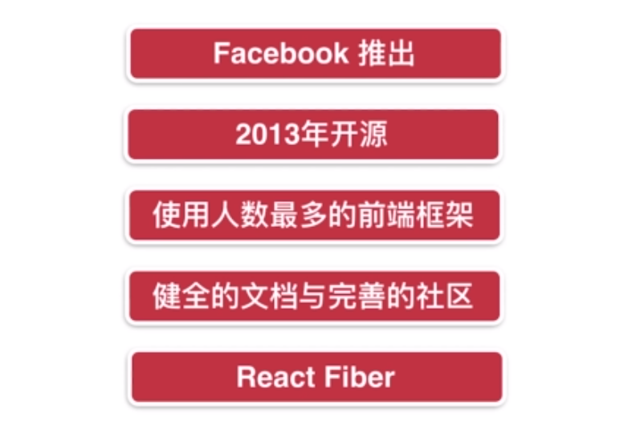

React Fiber：React16之后的版本

## 1-2 React开发环境搭建

首先本地安装node

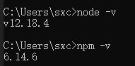

**Create React app**

```
npx create-react-app my-app
cd my-app
npm start
```

## 1-3 项目工程代码精简

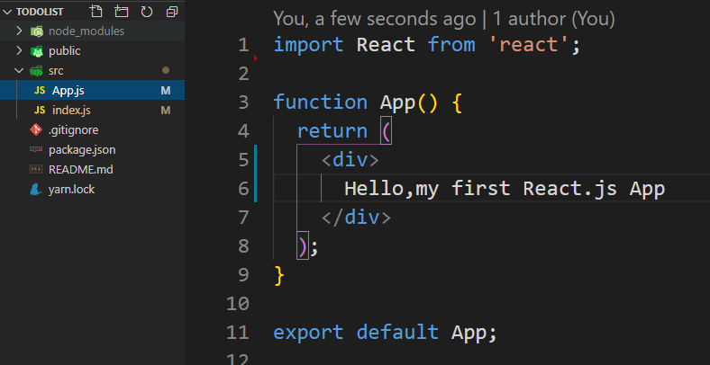

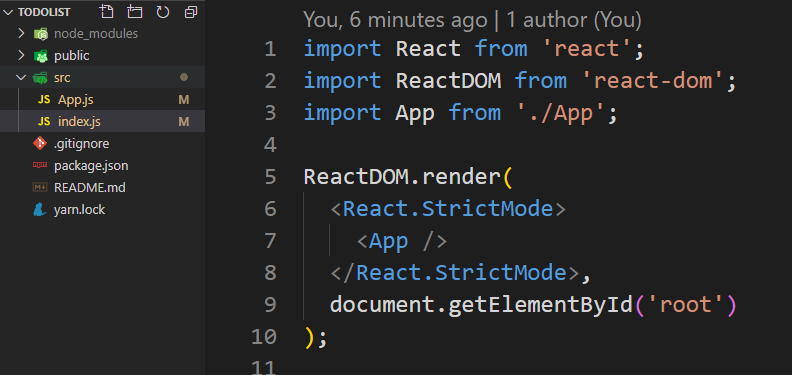

## 1-4 什么是组件

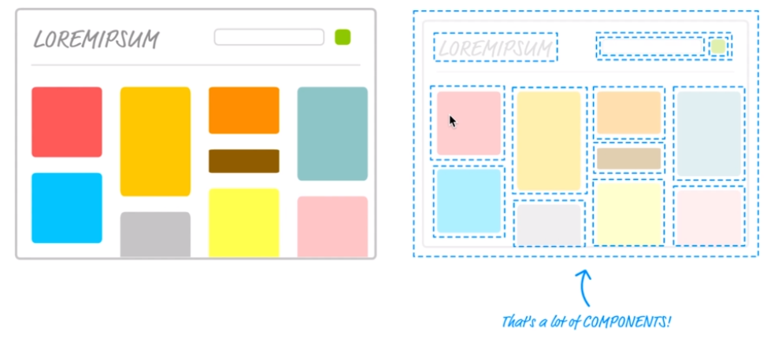

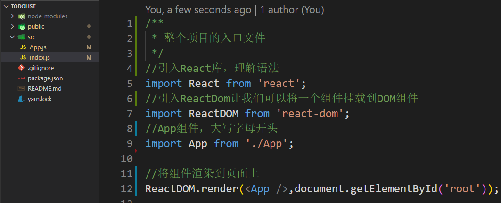

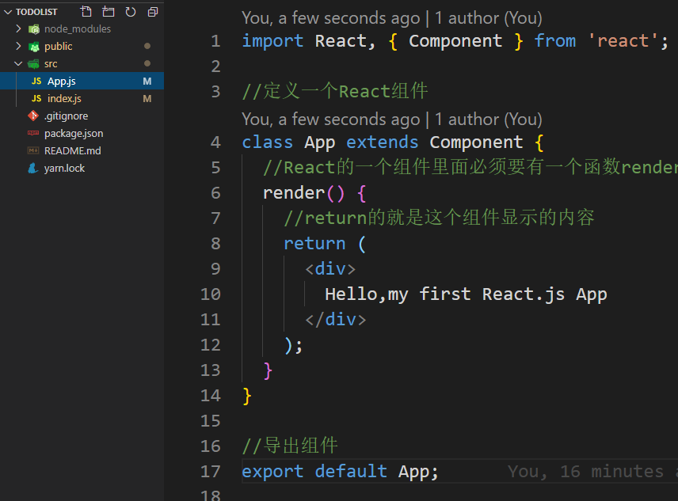

## 1-5 简单的JSX语法

App.js

```js
import React, { Component } from 'react';

//定义一个React组件
class App extends Component {
  //React的一个组件里面必须要有一个函数render
  render() {
    //return的就是这个组件显示的内容
    //jsx 语法，除了写标签，还可以在{}里面写js的表达式
    return (
      <div>
        {1+2}
        Hello,my first React.js App
      </div>
    );
  }
}

//导出组件
export default App;

```

index.js

```js
/**
 * 整个项目的入口文件
 */
//引入React库，理解语法
import React from 'react';
//引入ReactDom让我们可以将一个组件挂载到DOM组件
import ReactDOM from 'react-dom';
//App组件，大写字母开头
import App from './App';

//将组件渲染到页面上
ReactDOM.render(<App />,document.getElementById('root'));
```

# 2. React实战

实现一个TodoList

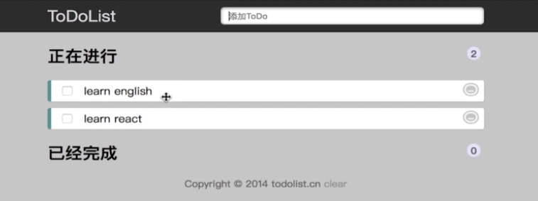

## 2-1 编写TodoList功能

本实例需要注意的点

* JS基础：this指向
* ES6语法 constrcuctor 

## 2-2 完成新增列表项的功能

看代码

## 2-3 实现列表项的删除功能

看代码

TodoList.js

```html
import React, { Component } from 'react';

//定义一个React组件
class TodoList extends Component {

  constructor(props){
    super(props);
    this.state = {
      list:[],
      inputValue:'',
    }
  }

  handleBtnClick(){
    if(this.state.inputValue == ''){
      alert("请输入代办项内容");
      return;
    }
    this.setState({
      list:[...this.state.list,this.state.inputValue],
      inputValue:'',
    });
  }

  handleInputChange(e){
    this.setState({
      inputValue:e.target.value
    });
    console.log(e.target.value);
  }

  handleItemClick(index){
    const list = [...this.state.list];
    list.splice(index,1);
    this.setState({
      list:list
    })
  }


  render() {
    return (
      <div>
        <div>
          <input value={this.state.inputValue} onChange={this.handleInputChange.bind(this)}/>
          <button onClick={this.handleBtnClick.bind(this)}>add</button>
        </div>
        <ul>
          {
            this.state.list.map((item,index) =>{
              return <li key={index} onClick={this.handleItemClick.bind(this,index)}>{item}</li>
            })
          }
        </ul>
      </div>
    );
  }
}

//导出组件
export default TodoList;

```

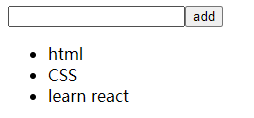

# 3.React组件与通信

上述实现的事一个叫做TodoList的组件，下面我们要将他分为两个组件

新建一个组件 TodoItem

## 3-1 React组件的拆分

> * **父组件通过属性的方式向子组件传递参数**
> * **子组件通过props接受父组件传递过来的参数**

## 3-2 子组件向父组件传值的方式

> * **子组件如果想和父组件通信，子组件要调用父组件传递过来的方法**

TodoList.js完整代码

```js
import React, { Component } from 'react';

import TodoItem from './TodoItem'

//定义一个React组件
class TodoList extends Component {

  constructor(props){
    super(props);
    this.state = {
      list:[],
      inputValue:'',
    }
  }

  handleBtnClick(){
    if(this.state.inputValue == ''){
      alert("请输入代办项内容");
      return;
    }
    this.setState({
      list:[...this.state.list,this.state.inputValue],
      inputValue:'',
    });
  }

  handleInputChange(e){
    this.setState({
      inputValue:e.target.value
    });
    //console.log(e.target.value);
  }
  
  handleDelete(index){
    const list = [...this.state.list];
    list.splice(index,1);
    this.setState({
      list:list
    })
  }

  render() {
    return (
      <div>
        <div>
          <input value={this.state.inputValue} onChange={this.handleInputChange.bind(this)}/>
          <button onClick={this.handleBtnClick.bind(this)}>add</button>
        </div>
        <ul>
          {
            this.state.list.map((item,index) =>{
              return <TodoItem delete={this.handleDelete.bind(this)}key={index} content={item} index={index}/>
            })
          }
        </ul>
      </div>
    );
  }
}

//导出组件
export default TodoList;

```

TodoItem.js完整代码

```js
import React from 'react'

class TodoItem extends React.Component{

  handleDelete(){
    this.props.delete(this.props.index)
  }

  render(){
    return (
      <div onClick={this.handleDelete.bind(this)}>{this.props.content}</div>
    )
  }
}

export default TodoItem;
```

## 3-3 代码优化

优化后的版本

TodoList.js完整代码

```js
import React, { Component } from 'react';

import TodoItem from './TodoItem'

//定义一个React组件
class TodoList extends Component {

  constructor(props){
    super(props);
    this.state = {
      list:[],
      inputValue:'',
    }

    this.handleInputChange = this.handleInputChange.bind(this);
    this.handleBtnClick = this.handleBtnClick.bind(this);
    this.handleDelete = this.handleDelete.bind(this);
  }

  handleBtnClick(){
    if(this.state.inputValue == ''){
      alert("请输入代办项内容");
      return;
    }
    this.setState({
      list:[...this.state.list,this.state.inputValue],
      inputValue:'',
    });
  }

  handleInputChange(e){
    this.setState({
      inputValue:e.target.value
    });
    //console.log(e.target.value)
  }
  
  handleDelete(index){
    const list = [...this.state.list];
    list.splice(index,1);
    this.setState({
      list:list
    })
  }

  getTodoItems(){
    return (
      this.state.list.map((item,index) =>{
        return (
          <TodoItem 
            delete={this.handleDelete}
            key={index} 
            content={item} 
            index={index}
          />)
      })
    )
  }

  render() {
    return (
      <div>
        <div>
          <input value={this.state.inputValue} onChange={this.handleInputChange}/>
          <button onClick={this.handleBtnClick}>add</button>
        </div>
        <ul>
          {this.getTodoItems()}
        </ul>
      </div>
    );
  }
}

//导出组件
export default TodoList;

```

TodoItem.js完整代码

```js
import React from 'react'

class TodoItem extends React.Component{

  constructor(props){
    super(props);
    this.handleDelete = this.handleDelete.bind(this)
  }

  handleDelete(){
    this.props.delete(this.props.index);
  }

  render(){
    const {content } = this.props;
    return (
      <div onClick={this.handleDelete}>{content}</div>
    )
  }
}

export default TodoItem;
```

# 4. React中的样式布局

## 4-1 Reacr中使用CSS样式修饰

新增css样式

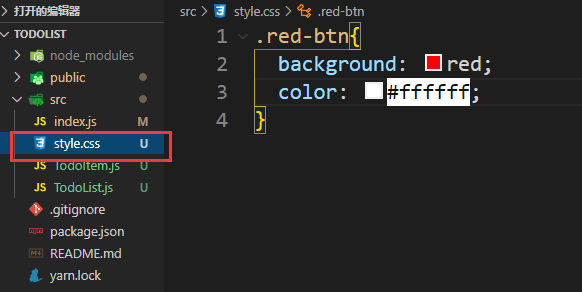

在TodoList.js中首先引入

```js
import './style.css'
```

然后使用`className`来使用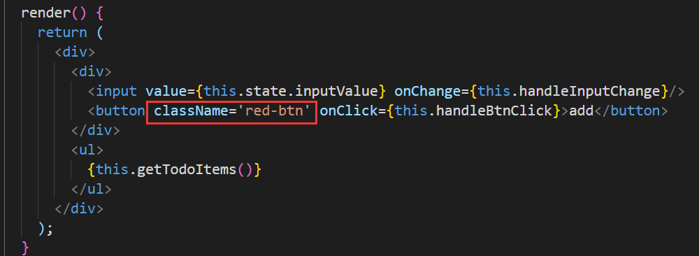

# 补充：如何学习React

* React官网学习：Docs读
* React16.4 开发简书项目