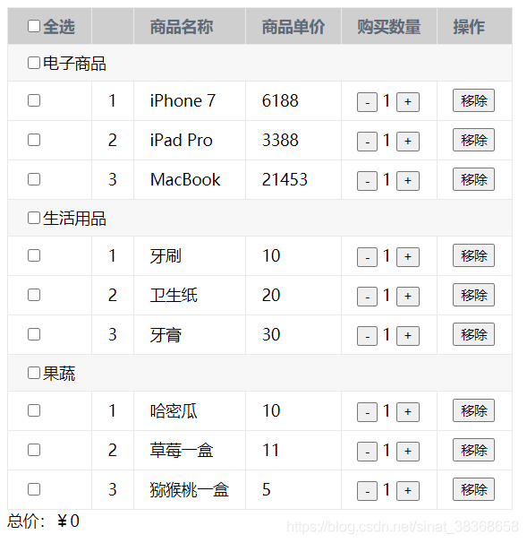
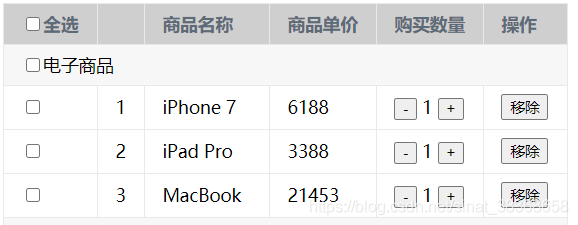
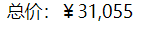

@[toc]
# 效果预览
***
例子来源于《Vue.js实战》ch5.5练习题。

购物车需要一个已加入购物车的商品列表，可以实时显示购买的总价，可以增减购买数量，或移除条目，也可以分类结算


# 实现思路
本实例有3个文件
* index.html （引入资源及模板）
* index.js （Vue实例及业务代码）
* style.css（样式）

用到的数据是一个数组list，部分数据格式如下

```js
data() {
    return {
      //是否全选
      isAllCheck: false,
      //购物车列表
      list: [
        {
          cateName: '电子商品',
          cateSelect:false,
          goodsList: [
            {
              id: 1,
              name: 'iPhone 7',
              price: 6188,
              count: 1,
              select: false,
            }
          ]
        },
        {
          cateName: '生活用品',
          cateSelect:false,
          goodsList: [
            {
              id: 1,
              name: '牙刷',
              price: 10,
              count: 1,
              select: false,
            },
          ]
        },
      ]       
    }
  },
```

因为每个商品都可以移除，所以当列表为空时，在页面显示“购物车为空”

```js
  <div id="app" v-cloak>
    <template v-if="list.length">
    //写表格内容
    </template>
    <div v-else>
      购物车为空
    </div>
```
template里的代码分两部分
* 是商品列表信息，使用table展现，用v-for循环展示数组

*  商品总价（带有千位分隔符），注意这里使用了一个政策表达式


给`button`动态绑定方法，在index.js中的methods中实现。

```html
<td>
    <button @click="handleReduce(item,index)" :disabled="item.count === 1">-</button>
     {{good.count}}
     <button @click="handleAdd(item,index)">+</button>
 </td>
 <td>
     <button @click="handleRemove(item,index)">移除</button>
 </td>
```

# 完整代码
***
## index.html

```html
<!DOCTYPE html>
<html lang="en">
<head>
  <meta charset="UTF-8">
  <meta name="viewport" content="width=device-width, initial-scale=1.0">
  <title>购物车实例</title>
  <link rel="stylesheet" type="text/css" href="style.css">
</head>
<body>
  <div id="app" v-cloak>
    <template v-if="list.length">
      <table>
        <!--表格头 商品列表信息-->
        <thead>
          <tr>
            <th>
              <input type="checkbox" v-model="isAllCheck" @change="selectedAll">全选
            </th>
            <th></th>
            <th>商品名称</th>
            <th>商品单价</th>
            <th>购买数量</th>
            <th>操作</th>
          </tr>
        </thead>
        <!--表格体 按分类展示商品-->
        <tbody v-for="item in list" v-if="item.goodsList.length" @change="allCate()">
          <tr class="cate">
            <td colspan="6">
              <input type="checkbox" v-model="item.cateSelect" @change="selectedCateAll(item)">{{item.cateName}}</td>
          </tr>
          <tr v-for="(good,index) in item.goodsList">
            <td>
              <input type="checkbox" v-model="good.select" @change="isChecked(item)">
            </td>
            <td>{{index+1}}</td>
            <td>{{good.name}}</td>
            <td>{{good.price}}</td>
            <td>
              <button @click="handleReduce(item,index)" :disabled="item.count === 1">-</button>
              {{good.count}}
              <button @click="handleAdd(item,index)">+</button>
            </td>
            <td>
              <button @click="handleRemove(item,index)">移除</button>
            </td>
          </tr>
        </tbody>
      </table>
      <div>总价：￥{{totalPrice}}</div>
    </template>
    <div v-else>
      购物车为空
    </div>
  </div>
  <script src="https://cdn.jsdelivr.net/npm/vue/dist/vue.js"></script>
  <script src="index.js"></script>
</body>
</html>
```
## index.js
```js
var app = new Vue({
  el: '#app',
  data() {
    return {
      //是否全选
      isAllCheck: false,
      //购物车列表
      list: [
        {
          cateName: '电子商品',
          cateSelect:false,
          goodsList: [
            {
              id: 1,
              name: 'iPhone 7',
              price: 6188,
              count: 1,
              select: false,
            },
            {
              id: 2,
              name: 'iPad Pro',
              price: 3388,
              count: 1,
              select: false,
            },
            {
              id: 3,
              name: 'MacBook',
              price: 21453,
              count: 1,
              select: false,
            }
          ]
        },
        {
          cateName: '生活用品',
          cateSelect:false,
          goodsList: [
            {
              id: 1,
              name: '牙刷',
              price: 10,
              count: 1,
              select: false,
            },
            {
              id: 2,
              name: '卫生纸',
              price: 20,
              count: 1,
              select: false,
            },
            {
              id: 3,
              name: '牙膏',
              price: 30,
              count: 1,
              select: false,
            }
          ]
        },
        {
          cateName: '果蔬',
          cateSelect:false,
          goodsList: [
            {
              id: 1,
              name: '哈密瓜',
              price: 10,
              count: 1,
              select: false,
            },
            {
              id: 2,
              name: '草莓一盒',
              price: 11,
              count: 1,
              select: false,
            },
            {
              id: 3,
              name: '猕猴桃一盒',
              price: 5,
              count: 1,
              select: false,
            }
          ]
        }
      ]       
    }
  },
  computed: {
    totalPrice: function () {
      var total = 0;
      for (let i = 0; i < this.list.length; i++) {
        let item = this.list[i];
        for(let j=0;j<item.goodsList.length;j++){
          if (item.goodsList[j].select === true) {
            total += item.goodsList[j].price * item.goodsList[j].count;
          }
        }
      }
      return total.toString().replace(/\B(?=(\d{3})+$)/g, ',');
    }
  },
  methods: {
    //监听表格内容变换，当分类按钮变化时，全选按钮变化
    allCate(){
      let cateSelect = 0;
      this.list.forEach(item => {
        if(!item.cateSelect){
          this.isAllCheck = false;
          return;
        }else{
          cateSelect+=1;
        }
      });
      if(cateSelect === this.list.length){
        this.isAllCheck = true;
      }
    },
    //点击全选按钮，控制所有分类
    selectedAll: function () {
      this.list.forEach(item => {
        if(this.isAllCheck){
          item.cateSelect = true;
        }else{
          item.cateSelect = false
        }
        this.selectedCateAll(item);
      })
    },
    //点击某一商品,其父选项分类变化
    isChecked(item) {
      //当子选项全选中时，分类按钮也要选中，反之则不选中
      var listSelected = [];
      var listUnselected = [];
      item.goodsList.forEach(good => {
        if (good.select) {
          listSelected.push(good.select);
        } else {
          listUnselected.push(good.select);
        }
      })
      //当listSelect的长度等于list长度时，说明该分类下全部选中
      if (listSelected.length == item.goodsList.length) {
        item.cateSelect = true;
      }
      //当listUnselected中有数据，说明该分类下有没有勾选的子选项
      if (listUnselected.length > 0) {
        item.cateSelect = false;
      }
    },
    //控制某一分类的商品数据全选/全不选
    selectedCateAll(item){
      item.goodsList.forEach(good =>{
        if(item.cateSelect){
          good.select = true;
        }else{
          good.select = false;
          this.isAllCheck = false ;
        }
      })
    },
    //某一商品减少数量
    handleReduce: function (curitem,index) {
      this.list.forEach(item =>{
        if(item.cateName === curitem.cateName){
          if(item.goodsList[index].count === 1){
            return;
          }
          item.goodsList[index].count--;
        }
      })
    },
    //某一商品增加数量
    handleAdd: function (curitem,index) {
      this.list.forEach(item =>{
        if(item.cateName === curitem.cateName){
          item.goodsList[index].count++;
        }
      })
    },
    //移除某一商品
    handleRemove: function (curitem,index) {
      this.list.forEach(item =>{
        if(item.cateName === curitem.cateName){
          item.goodsList.splice(index,1);
        }
      })
    }
  }
})
```
## style.css

```css
[v-cloak]{
  display: none;
}
table{
  border: 1px solid #e9e9e9;
  border-collapse: collapse;
  border-spacing: 0;
  empty-cells: show;
}
th,td{
  padding: 8px 16px;
  border: 1px solid #e9e9e9;
  text-align: left;
}
th{
  background: #b8b7b7ab;
  color:#5c6b77;
  font-weight: 600;
  white-space: nowrap;
}

.cate{
  background:  #f7f7f7;
}
```