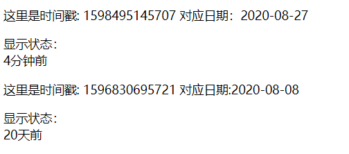

# 开发一个实时时间转换指令 v-time



朋友圈微博的发布的动态会有一个相对于本机时间转换后的相对时间

一般服务端存储的时间格式是Unix时间戳，例如2017-01-01 00：00：00 的时间戳是148320000，前端拿到数据后，把它转化为可读的时间格式再显示出来。

我们实现一个自定义指令v-time，将表达式传入的时间戳实施转换为相对时间。

index.html 用来演示

```html
<!DOCTYPE html>
<html lang="en">
<head>
  <meta charset="UTF-8">
  <meta name="viewport" content="width=device-width, initial-scale=1.0">
  <title>时间转换指令</title>
</head>
<body>
  <div id="app" v-cloak>
    <p>这里是时间戳: {{timeNow}} 对应日期：{{timeNowFormat}}</p>
    显示状态：
    <div v-time="timeNow"></div>
    <p>这里是时间戳: {{timeBefore}} 对应日期:{{timeBeforeFormat}}</p>
    显示状态：
    <div v-time="timeBefore"></div>
  </div>

  <script src="https://cdn.jsdelivr.net/npm/vue/dist/vue.js"></script>
  <script src="time.js"></script><!--注意这里定义directives要在new Vue前面，不然会找不到指令-->
  <script src="index.js"></script>
</body>
</html>
```

index.js

```js

var app = new Vue({
  el:'#app',
  data:{
    timeNow:(new Date()).getTime(),
    timeBefore:1596830695721 //2020-08-07 本示例使用的时间戳都是毫秒级
  },
  computed:{
    timeNowFormat:function(){
      return Time.getLastDate(this.timeNow);
    },
    timeBeforeFormat:function(){
      return Time.getLastDate(this.timeBefore);
    }
  }
})
```

分析时间转换的逻辑

| 时间                  | 显示         |
| --------------------- | :----------- |
| 1分钟以前             | 刚刚         |
| 1分钟~1小时之间       | xx分钟前     |
| 1小时~1天之间         | xx小时前     |
| 1天~1个月（31天）之间 | xx天前       |
| 大于1个月             | xx年xx月xx日 |

time.js里面是一系列与时间相关的函数

```js
var Time = {
  //获取当前时间戳
  getUnix:function(){
    var date = new Date();
    return date.getTime();
  },
  //获取今天0点0分0秒的时间戳
  getTodayUnix:function(){
    var date = new Date();
    date.setHours(0);
    date.setMinutes(0);
    date.setSeconds(0);
    date.setMilliseconds(0);
    return date.getTime();
  },
  //获取今年1月1日0点0分0秒的时间戳
  getYearUnix:function(){
    var date = new Date();
    date.setMonth(0);//注意，这里是1月
    date.setDate(1);
    date.setHours(0);
    date.setMinutes(0);
    date.setSeconds(0);
    date.setMilliseconds(0);
    return date.getTime();
  },
  //获取标准年月日
  getLastDate:function(time){
    var date = new Date(time);
    var month = date.getMonth()+1 <10 ? '0'+(date.getMonth()+1):date.getMonth()+1;
    var day = date.getDate()<10 ? '0'+date.getDate():date.getDate();
    return date.getFullYear() + '-' + month + "-" + day;
  },
  //转换时间
  getFormatTime:function(timestamp){
    var now = this.getUnix();//当前时间戳
    var today = this.getTodayUnix();//今天0点时间戳
    var year = this.getYearUnix();//今年0点时间戳
    var timer = (now-timestamp)/1000;//转换为秒级时间戳

    if(timer<=0){
      tip='刚刚';
    }else if(Math.floor(timer/60)<=0){
      tip='刚刚';
    }else if(timer<3600){
      tip = Math.floor(timer/60)+'分钟前';
    }else if(timer>=3600 && (timestamp-today>=0)){
      tip = Math.floor(timer/3600)+'小时前';
    }else if(timer/86400<=31){
      tip = Math.ceil(timer/86400)+'天前';
    }else{
      tip = this.getLastDate(timestamp);
    }
    return tip;
  }
}

Vue.directive('time',{
  bind:function(el,binding){
    el.innerHTML = Time.getFormatTime(binding.value);
    el.__timeout__ = setInterval(function(){
      el.innerHTML = Time.getFormatTime(binding.value);
    },60000);
  },
  unbind:function(el){
    clearInterval(el.__timeout__);
    delete el.__timeout__;
  }
});

```

Time.js中定义自定义指令

```
Vue.directive('time',{
  bind:function(el,binding){
    el.innerHTML = Time.getFormatTime(binding.value);
    el.__timeout__ = setInterval(function(){
      el.innerHTML = Time.getFormatTime(binding.value);
    },60000);
  },
  unbind:function(el){
    clearInterval(el.__timeout__);
    delete el.__timeout__;
  }
});

```

在bind钩子里，将指令v-time表达式的值`binding.value`作为参数传入`Time.getFormatTime()`方法得到格式化使劲按，再通过`el.innerHTML`写入指令所在元素。定时器`el.__timeout__`每分钟触发一次，更新时间，并且在unbind钩子里清除掉。