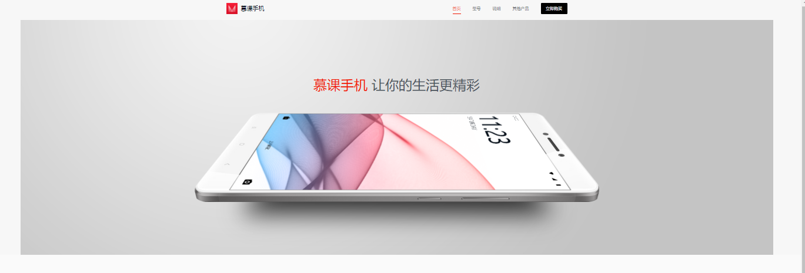
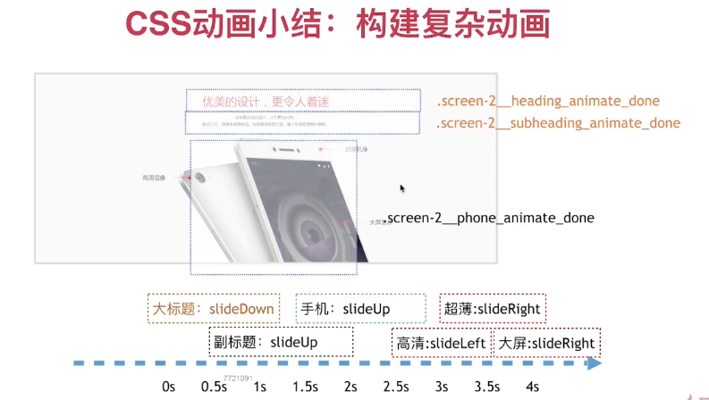
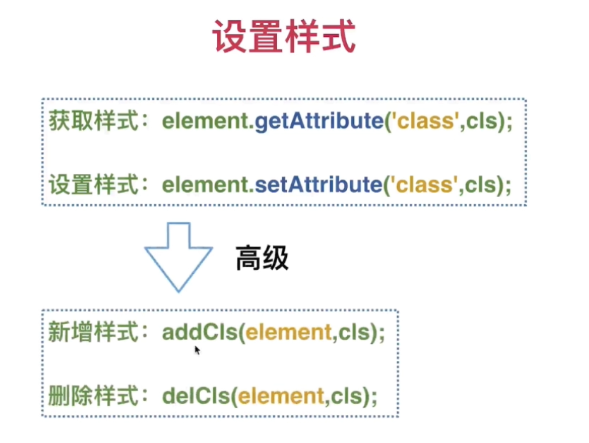
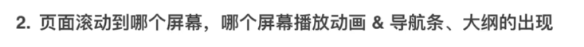

# 手机宣传页项目

学完html+css+js基础的一个综合项目实战

# 1. 介绍

**学习内容**

* 前端开发流程以及必要的工具使用
* HTML5的标签，标签的结构：BEM开发模式
* CSS3，CSS过渡动画，帧动画
* JS元素的获取，事件响应处理

**相关工具**

标注工具：PxCook

# 2. 准备工作

## 2.1 设计图标注

首先标注


## 2.2 雪碧图

两张图片合为一张能减少HTTP请求，网站速度会更快

使用工具生成雪碧图 http://alloyteam.github.io/gopng/


得到的雪碧图


网站生成的样式有一些可以用，例如可以获得图片的宽高

```css
#gopng_phone-1_outer {
height: 270px;
width: 240px;
overflow: hidden;
}
```


# 3. 页面的内容和样式

## 3.1 静态页面开发准备

**背景知识：HTML5标签**

1. 语义化标签：header nav article aside footer
2. 多媒体，新特性：video canvas
3. 其他不常用：command，datalist

**开发技巧**

1. 从大到小
2. BEM开发模式

**扩展：BEM开发模式**

BEM代表块（Block），元素（Element），修饰符（Modifier）

对于下面这一屏：


根据BEM得到的层级关系是：


## 3.2 header头部LOGO制作

根据标注文件来编写html


可以注意的点

* 因为width是包含padding的，所以对于`padding-left`可以使用`text-indent`来代替

  ```css
  .header___logo{
    width: 150px;
    height: 38px;
    font-size: 20px;
    color: #07111b;
    text-indent: 50px;/*也可以使用padding-left: 50px;但一定要记得将width设置为100，因为宽度是包含padding的*/
  }
  ```

* 对于头部header可以使用一个wrap来包裹

  ```html
    <header class="header">
      <div class="header__wrap">
        <div class="header__logo">慕课手机</div>
      </div>
    </header>
  ```

  ```css
  .header{
    background-color: #f7f7f7;
  }
  .header__wrap{
    height: 80px;
    width: 1200px;
    position: relative;/*包含logo，要设置position:relative*/
  }
  .header__logo{
    width: 150px;
    height: 38px;
    font-size: 20px;
    color: #07111b;
    text-indent: 50px;
    background: url('../img/logo.png') left center no-repeat;
    background-size:38px 38px;
    line-height: 38px;/*文字垂直居中*/
    position: absolute;/*设置absolute让其top生效*/
    top:50%;
    margin-top: -19px;/*高度的一半*/
    left:20px
  }
  ```

  


## 3.3 header头部导航条制作

、

结构

```html
<div class="header__wrap">
      <div class="header__logo">慕课手机</div>
      <nav class="header__nav">
        <a href="javascirpt:;" class="header__nav-item header__nav-item_status_active">首页</a>
        <a href="javascirpt:;" class="header__nav-item">型号</a>
        <a href="javascirpt:;" class="header__nav-item">说明</a>
        <a href="javascirpt:;" class="header__nav-item">其他产品</a>
        <a href="javascirpt:;" class="header__nav-item header__nav-item_custom_button">立即购买</a>
      </nav>
    </div>
```

css样式

```css
.header__nav{
  height: 38px;
  position: absolute;
  right: 20px;
  top: 50%;
  margin-top: -19px;
}
.header__nav-item{
  color: #292f35;
  font-size: 14px;
  display: block;
  display: block;
  height: 38px;
  float: left;
  margin-left:40px;
  line-height: 38px;
  position: relative;
}
.header__nav-item:hover{
  color:#f01400;

}

.header__nav-item_status_active{
  color:#f01400;
}

.header__nav-item_status_active::after{
  content: '';
  display: block;
  width: 100%;
  height: 2px;
  position: absolute;
  left: 0;
  bottom: 0;
  background-color: #f01400;
}

.header__nav-item_custom_button{
  background-color: #000;
  color: #f4f4f5;
  text-align: center;
  width: 90px;
  border-radius: 3px;
}
```

这里有个地方需要注意：


在地下划线这个特效，可以给需要划线的nav-item设置特定的状态

```css
.header__nav-item{
  color: #292f35;
  font-size: 14px;
  display: block;/*块元素*/
  height: 38px;
  float: left;
  margin-left:40px;
  line-height: 38px;
  position: relative;/*相对定位，方便其内容的伪元素进行定位*/
}
```

父级元素要设置relative

```css
.header__nav-item_status_active{
  color:#f01400;
}

.header__nav-item_status_active::after{
  content: '';
  display: block;
  width: 100%;/*这里指的是nav-item的宽度*/
  height: 2px;
  position: absolute;/*定位元素*/
  left: 0;
  bottom: 0;
  background-color: #f01400;
}
```

伪元素设置absolute，然后宽度是100%，才能保证该下划线如图效果

由于其::after伪元素相对于nav-item绝对定位，因此伪元素也转到下一行。

## 3.4 居中方法总结

**1. 文字垂直居中**


```css
.header__nav-item{
  height: 38px;
  line-height: 38px;
}
```

**2. 块元素垂直居中于父元素**


```css
.header__wrap{
  height: 80px;
  position: relative;/*允许子元素相对它定位*/
}
```

```css
.header__logo{
  height: 38px;
  position: absolute;/*设置absolute让其top生效*/
  top:50%;
  margin-top: -19px;/*高度的一半*/
}
```

**3. 块元素（容器）水平居中**


```css
.header__wrap{
  width: 1200px;
  margin: 0 auto;/*水平居中*/
}
```


## 3.5 页面第一屏

 

**第一屏样式总结**

1. **块元素水平居中**

   * `margin:0 auto`让容器在父元素中居中

   * <font color='red'> **负边距居中** </font>

     ```css
     width:100px;
     left:50%;margin-left:-50px
     ```

     注意：

     * 这个元素首先是一个块级元素（才能设置宽度）
     * 该元素需设置`position:absolute`才能进行相对定位
     * 其父元素需设置`positioin:relative`才让支持其子元素对其进行相对定位

2. **背景图覆盖模式` background-size: cover;`**

   * 设置

     

   * 不设置

     

     

## 3.6 页面第二屏


```html
<div class="screen-2">
      <h2 class="screen-2__heading">优美的设计，更令人着迷</h2>
      <h3 class="screen-2__subheading">采用受欢迎的设计，让它更加出色。<br>款式小巧、轻便手感更舒适。绚丽高清的显示屏，整个外观显得格外精致。</h3>
      <div class="screen-2__phone">
        <div class="screen-2__point screen-2__point_i-1">高清摄像</div>
        <div class="screen-2__point screen-2__point_custom_right screen-2__point_i-2">超薄机身</div>
        <div class="screen-2__point screen-2__point_custom_right screen-2__point_i-3">大屏显示</div>
      </div>
    </div>
```


## 3.7 页面第三屏


```html
<div class="screen-3">
      <div class="screen-3__wrap">
        <h2 class="screen-3__heading">外形小巧，功能强大的手机</h2>
        <h3 class="screen-3__subheading">采用受欢迎的设计，让它更加出色。<br>款式小巧、轻便手感更舒适。绚丽高清的显示屏，整个外观显得格外精致。</h3>
        <div class="screen-3__phone"></div>
        <div class="screen-3__features">
          <div class="screen-3__features_item">
            <div class="screen-3__features_item__number">5.7</div>
            <div class="screen-3__features_item__desc">英寸大屏</div>
          </div>
          <div class="screen-3__features_item">
            <div class="screen-3__features_item__number">1200</div>
            <div class="screen-3__features_item__desc">万像素</div>
          </div>
          <div class="screen-3__features_item">
            <div class="screen-3__features_item__number">3D</div>
            <div class="screen-3__features_item__desc">touch</div>
          </div>
          <div class="screen-3__features_item">
            <div class="screen-3__features_item__number">A9</div>
            <div class="screen-3__features_item__desc">处理器</div>
          </div>
        </div>
      </div>
    </div>
```


## 3.8 页面第四屏


```html
<div class="screen-4">
      <div class="screen-4__wrap">
        <h2 class="screen-4__heading">丰富的手机型号</h2>
        <h3 class="screen-4__subheading">找到适合你的手机。</h3>
        <div class="screen-4__type">
          <div class="screen-4__type__item screen-4__type__item_i_1">
            <div class="screen-4__type__item__color">慕课红</div>
            <div class="screen-4__type__item__storage">16G/32G/64G</div>
          </div>
          <div class="screen-4__type__item screen-4__type__item_i_2">
            <div class="screen-4__type__item__color">土豪金</div>
            <div class="screen-4__type__item__storage">16G/32G/64G</div>
          </div>
          <div class="screen-4__type__item screen-4__type__item_i_4">
            <div class="screen-4__type__item__color">绅士黑</div>
            <div class="screen-4__type__item__storage">16G/32G/64G</div>
          </div>
        </div>
      </div>
    </div>
```


## 3.9 页面第五屏


```html
 <div class="screen-5">
      <h2 class="screen-5__heading">游戏、学习、拍照、有这一部就够了</h2>
      <h3 class="screen-5__subheading">看视频、拍摄高清视频与照片、视频聊天，以及多功能，让您生活更丰富多彩</h3>
      <div class="screen-5__bg"></div>
    </div>
```

* background-size 属性规定背景图像的尺寸
  * contain 把图像图像扩展至最大尺寸，以使其宽度和高度完全适应内容区域。

## 3.10 第六屏


```html
    <div class="screen-buy">
      <a class="screen-buy__button" href="javascript:;">立即购买</a>
    </div>
```

分析这个结构，一张背景图片中间有一个按钮（居中）

* 让该按钮在父容器中水平居中？

  将按钮设置为`inline-block`，这样父元素可以使用`text-align:center`让其居中

  ```css
  .screen-buy{
    background: #2b333b url('../img/bg-screen-buy.png') center no-repeat;
    text-align: center;
  }
  .screen-buy__button{
    display: inline-block;
    height: 80px;
    width: 240px;
  }
  ```

* 让按钮在父容器中垂直居中？

  按钮的高度为80px，父元素设置高度为80px，然后用背景图片填充padding

  ```css
  .screen-buy{
    background: #2b333b url('../img/bg-screen-buy.png') center no-repeat;
    height: 80px;/*一个小技巧：设置高度为按钮的高度*/
    padding: 120px 0 120px 0;/*剩下的部分用padding填充，该屏总高度为120+80+120=320px*/
  }
  .screen-buy__button{
    display: inline-block;
    height: 80px;
  }
  ```

## 3.11 footer


```html
    <footer class="footer">
      ©2020-10-8 Elylicery's homework | use html+css+js
    </footer>
```


# 4. 网页动态效果

## 4.1 CSS动画背景知识

**CSS3新特性**

1. 新的选择器，eg `div:last-child`（div节点下面的最后一个直接子节点）
2. 多列布局：eg `-webkit-column-count:3`
3. 圆角：`border-radious`
4. 渐变背景图  `background-image:-webkit-gradient(linear,0%，0%，100%，from(#2A876E),to(#FE8934E);`
5. tranform
6. transitions
7. animation

**背景知识：CSS实现动画的两种方式**

1. transition:**all** 1s
2. -webkit-animation: **rock** 2s infinite ease-in-out .5s

## 4.2 命名约定以及测试脚本


通过click切换animation样式的脚本：

```js

var screenAnimateElements = {

  '.screen-1':[
    '.screen-1__heading',
    '.screen-1__phone',
    '.screen-1__shadow'
  ]
};

function setScreenAnimate(screenCls){
  
  var screen = document.querySelector(screenCls);//获取当前屏的元素
  var animateElements = screenAnimateElements[screenCls];//需要设置动画的元素

  var isSetAnimateClass = false;//是否有初始化子元素的样式
  var isAnimateDone = false;//当前屏幕下所有子元素的状态时DONE？

  screen.onclick = function(){
    //初始化样式,增加init A A_init
    if(isSetAnimateClass == false){
      for(var i=0;i<animateElements.length;i++){
        var element = document.querySelector(animateElements[i]);
        var baseCls = element.getAttribute('class');
        element.setAttribute('class',baseCls+' '+animateElements[i].substr(1)+'_animate_init')
      }
      isSetAnimateClass = true;
      return ;
    }  
    //切换所有animateElements的 init->done A A_done
    if(isAnimateDone === false){
      for(var i=0;i<animateElements.length;i++){
        var element = document.querySelector(animateElements[i]);
        var baseCls = element.getAttribute('class');
        element.setAttribute('class',baseCls.replace('_animate_init','_animate_done'));
      }
      isAnimateDone = true;
      return;
    }

    //切换所有animateElements的 done->init A A_init
    if(isAnimateDone === true){
      for(var i=0;i<animateElements.length;i++){
        var element = document.querySelector(animateElements[i]);
        var baseCls = element.getAttribute('class');
        element.setAttribute('class',baseCls.replace('_animate_done','_animate_init'));
      }
      isAnimateDone = false;
      return;
    }
  }
}

setScreenAnimate('.screen-1')
```


## 4.3 测试脚本小结

 


## 4.3 网页动态效果

* 使用过渡transition

  ```css
  .screen-1__shadow{
    transition: all 1s;
  }
  ```

* 使用`transform: translate(0,-100%);`控制移动元素的动画

  

  

  

  ```css
  .screen-1__phone_animate_init{
    opacity: 0;
    transform: translate(0,-100%);
  }
  .screen-1__phone_animate_done{
    opacity: 1;
    transform: translate(0,0);
  }
  ```

* 使用`transform: scale(.5)`实现缩放效果

  

  ```css
  .screen-3__features_animate_init{
  	opacity: 0;
  	transform: scale(.5);/*缩放效果*/
  }
  .screen-3__features_animate_done{
  	opacity: 1;
  	transform: scale(1);
  }
  ```

* 使用`:hover`实现鼠标放上去的一个聚焦效果

  

  ```css
  .screen-3__features_item{
  	transition: all .5s;
  	cursor: pointer;
  }
  .screen-3__features_item:hover{
  	transform: scale(1.1);
  	border-color: #fff;/*鼠标放上去的一个聚焦效果*/
  }
  ```

* 通过控制`transition`的tranistion-delay属性来实现多个元素渐进的效果

  

  上图四个手机依次出现

  ```css
  .screen-4__type__item_i_1{
  	transition: all 1s .5s;
  }
  .screen-4__type__item_i_2{
  	transition: all 1s 1s;
  }
  .screen-4__type__item_i_3{
  	transition: all 1s 1.5s;
  }
  .screen-4__type__item_i_4{
  	transition: all 1s 2s;
  }
  .screen-4__type__item_i_1_animate_init,
  .screen-4__type__item_i_2_animate_init,
  .screen-4__type__item_i_3_animate_init,
  .screen-4__type__item_i_4_animate_init{
  	opacity: 0;
  }
  
  
  .screen-4__type__item_i_1_animate_done,
  .screen-4__type__item_i_2_animate_done,
  .screen-4__type__item_i_3_animate_done,
  .screen-4__type__item_i_4_animate_done{
  	opacity: 1;
  }
  ```

## 4.4 扩展-循环动画


例如实现这个效果：


首先定义这个动画：

```css
/*定义帧动画*/
@-webkit-keyframes bounce{
  0%,100% {
    transform: scale(0);
  }
  50% {
    transform: scale(1);
  }
}
```

将它用在`.screen-2__point`元素上，它是一个块元素，我们为其增加两个伪元素

```css
/*使用帧动画*/
.screen-2__point::before,
.screen-2__point::after{
  content: '';/*注意伪元素要显示出来一定要有内容*/
  display: block;
  width: 20px;
  height: 20px;
  position: absolute;
  top:1px;
  left: 0px;
  background-color: #ff0000;
  opacity: .4;
  -webkit-animation: bounce 2s infinite;
  border-radius: 50%;
}

.screen-2__point::before{
  -webkit-animation: bounce 2s infinite 1s;
}

.screen-2__point_i_1::before,
.screen-2__point_i_1::after{
  content: '';
  display: block;
  width: 20px;
  height: 20px;
  position: absolute;
  top:1px;
  left: 200px;
  background-color: #ff0000;
  opacity: .4;
  -webkit-animation: bounce 2s infinite;
  border-radius: 50%;
}
```


注意：

* 如果一个元素有left和right，一定是left生效，因为point-1和另外两个不一样，不是左对齐而是右对齐，所以为它单独设置样式 `left:200`

## 4.5 CSS3动画总结




# 5. 网页交互效果

## 5.1 背景知识及效果预览





## 5.2 基本函数

```js
//获取元素 
var getElem = function(selector){
  return document.querySelector(selector);
}
var getAllElem = function(selector){
  return document.querySelectorAll(selector);
}

//获取元素样式 
var getCls = function(element){
  return element.getAttribute('class');
}
//设置元素样式
var setCls =function(element,cls){
  return element.setAttribute('class',cls);
}
//为元素添加样式
var addCls = function(element,cls){
  var baseCls = getCls(element);
  if(baseCls.indexOf(cls) === -1){
    setCls(element,baseCls+' '+cls);
  }
}
// 为元素删减样式
var delCls = function( element , cls){
  var baseCls  = getCls(element);
  if( baseCls.indexOf(cls) > -1){ // 更精确的需要用正则表达式 ,因为这里只用于切换 _animate_in 所以没事
      setCls( element,baseCls.split(cls).join(' ').replace(/\s+/g,' ') );
  }
  return ;
} 
```


## 5.3 JS实现交互动画（导航条）

现在开始实现动画


```js
//设置屏内元素为初始状态
var screenAnimateElements = {
  '.screen-1' : [
    '.screen-1__heading',
    '.screen-1__phone',
    '.screen-1__shadow',
  ],
  '.screen-2' : [
    '.screen-2__heading',
    '.screen-2__subheading',
    '.screen-2__phone',
    '.screen-2__point_i_1',
    '.screen-2__point_i_2',
    '.screen-2__point_i_3',
  ],
  '.screen-3' : [
    '.screen-3__heading',
    '.screen-3__phone',
    '.screen-3__subheading',
    '.screen-3__features',
  ],
  '.screen-4' : [
    '.screen-4__heading',
    '.screen-4__subheading',
    '.screen-4__type__item_i_1',
    '.screen-4__type__item_i_2',
    '.screen-4__type__item_i_3',
    '.screen-4__type__item_i_4',
  ],
  '.screen-5' : [
     '.screen-5__heading',
    '.screen-5__subheading',
    '.screen-5__bg',
  ]

};
var setScreenAnimateInit = function(screenCls){
  var screen = document.querySelector(screenCls);//获取当前屏的元素
  var animateElements = screenAnimateElements[screenCls];//需要设置动画的元素
  for(var i=0;i<animateElements.length;i++){
    var element = document.querySelector(animateElements[i]);
    var baseCls = element.getAttribute('class');
    element.setAttribute('class',baseCls+' '+animateElements[i].substr(1)+'_animate_init')
  }
}
//第一步：初始化样式init
window.onload = function(){
  console.log('onload');
  for(k in screenAnimateElements){
    setScreenAnimateInit(k);
  }
}

//设置播放屏内的元素动画
var playScreenAnimateDone = function(screenCls){
  var screen = document.querySelector(screenCls);//获取当前屏的元素
  var animateElements = screenAnimateElements[screenCls];//需要设置动画的元素
  for(var i=0;i<animateElements.length;i++){
    var element = document.querySelector(animateElements[i]);
    var baseCls = element.getAttribute('class');
    element.setAttribute('class',baseCls.replace('_animate_init','_animate_done'));
  }
}
```



```js
//第二部：滚动的到哪里，就播放到哪里
var navItems = getAllElem('.header__nav-item');
var outLineItems = getAllElem('.outline__item');

var switchNavItemActive = function(idx){
  for(var i=0;i<navItems.length;i++){
    //console.log(navItems[i]);
    delCls(navItems[i],'header_nav-item_status_active');
  }
  addCls(navItems[idx],'header_nav-item_status_active');

  for(var i=0;i<outLineItems.length;i++){
    delCls(outLineItems[i],'outline__item_status_active');
  }
  addCls(outLineItems[idx],'outline__item_status_active');
}

window.onscroll = function(){
  var top  = document.body.scrollTop || document.documentElement.scrollTop;
  //console.log(top);
  if(top>80){
    addCls(getElem('.header'),'header_status_back');
    addCls(getElem('.outline'),'outline_status_in');
  }else{
    delCls(getElem('.header'),'header_status_back');
    delCls(getElem('.outline'),'outline_status_in');
    
    switchNavItemActive(0);
  }

  if(top>1){
    playScreenAnimateDone('.screen-1');
  }

  if( top > ( 800*1 - 100) ){
    playScreenAnimateDone('.screen-2');
    switchNavItemActive(1);
  }
  if( top > ( 800*2 - 100) ){
    playScreenAnimateDone('.screen-3');
    switchNavItemActive(2);
  }
  if( top > ( 800*3 - 100) ){
    playScreenAnimateDone('.screen-4');
    switchNavItemActive(3);
  }
  if( top > ( 800*4 - 100) ){
    playScreenAnimateDone('.screen-5');
    switchNavItemActive(4);
  }
}
```


## 5.4 导航条的双向绑定


```js
//第三步：双向定位


var setNavJump = function(i,lib){
  var item = lib[i];
  // console.log("item:",item);
  item.onclick = function(){
    document.body.scrollTop = i*800 + 1;
  }
}

for(var i=0;i<navItems.length;i++){
  setNavJump(i,navItems);
}

for(var i=0;i<outLineItems.length;i++){
  setNavJump(i,outLineItems);
}
```

## 5.5 JS实现滑动门效果


```js
// 滑动门
var navTip = getElem('.header__nav-tip');
var setTip = function(idx,lib){

  

  lib[idx].onmouseover =function(){
    console.log(this,idx);
    navTip.style.left = ( idx * 70 )+'px';
  }
  var currentIdx = 0;
  lib[idx].onmouseout = function(){
    console.log(currentIdx); 
    for(var i=0;i<lib.length;i++){
        if( getCls( lib[i] ).indexOf('header__nav-item_status_active') > -1  ){
          currentIdx = i;
          break;
        }
    }
    navTip.style.left = ( currentIdx * 70 )+'px';
  }

}

for(var i=0;i<navItems.length;i++){
  setTip(i,navItems);
}

```

  

