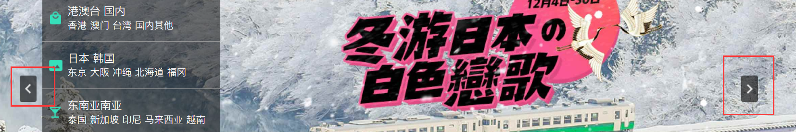
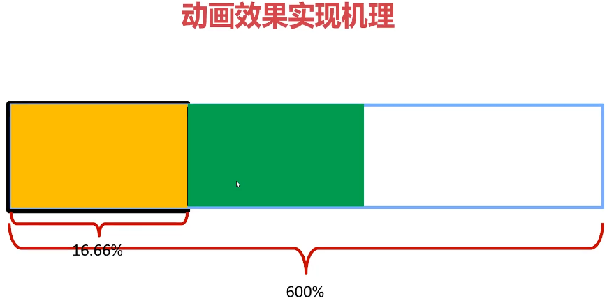

# 旅游网站首页

**整体效果**


**重置reset.css**

搜索 yui rest，在百度快照里就能看到


```js
<link rel="stylesheet" type="text/css" href="http://yui.yahooapis.com/3.18.1/build/cssreset/cssreset-min.css">
```

# HTML+CSS部分

## 页面顶部开发

**制作箭头**


利用两个菱形（正方形rotate45度得到），设置其定位的top不同，得到一个向下的箭头

**制作三角形**


```css
.site-head .main-nav ul li.have-menu{
  padding-right: 16px;
  position: relative;/*子绝父相*/
}
/*利用伪元素制作*/
.site-head .main-nav ul li.have-menu::before{
  content: '';
  position: absolute;
  right: 0;
  top: 18px;
  width: 0px;
  height: 0px;
  border: 4px solid transparent;/*核心：设置border*/
  border-top-color: white;
  border-bottom:none;/**/
}
```

**制作outline**

当鼠标进入input，会有一个外线


```css
/*取消默认的外线（外线是文本框默认的东西）*/
  outline: none; 
```

**字体图标**

iconfont

**banner制作**

使用min-width限制最小宽度。

## 页面中部开发

**垂直菜单制作**


父元素`width:100%`，每个子元素`width:16.66%`

不论盒子高度如何，六个盒子等分（所以要使用百分比写宽度和高度）

每个子元素的高是弹性的，中间的字大小是固定的，都是垂直居中

使用bosx-sizing：box-sizing:border-box属性的作用就是让height属性是盒子的总高度，这种情况：在盒子的高度是百分比写的，但是盒子有边框的时候

```css
.banner .center-wrap{
  /* 只要有压盖，第一时间就要想到绝对定位 */
  position: absolute;
  top: 0;
  left: 0;
  width: 1152px;
  left: 50%;
  margin-left: -576px;
  /* 这里的100%高度绝对不能省略，因为如果省略了，它的height就是0 */
  /* 那么它的子盒子设置16.6%就没有意义了 */
  height: 100%;
}
.banner .center-wrap .banner-nav {
  /* 注意，这里的100%也非常重要，因为如果省略了，它的height就是0  */
  /* 那么它的子盒子设置16.6%就没有意义了  */
  height: 100%;
}
.banner .center-wrap .banner-nav>ul {
  /* 注意，这里的100%也非常重要，因为如果省略了，它的height就是0  */
  /* 那么它的子盒子设置16.6%就没有意义了  */
  height: 100%;
}
.banner .center-wrap .banner-nav>ul>li {
  height: 16.66%;
  width: 296px;
  background-color: rgba(0,0,0,.53);
  border-bottom: 1px solid #9e9e9e; 
  /* box-sizing:border-box属性的作用就是让height属性是盒子的总高度，这种情况：在盒子的高度是百分比写的，但是盒子有边框的时候 */
  /* 此时就要让盒子的边框涵盖在height里面，就要使用box-sizing属性 */
  box-sizing: border-box; 
}
.banner .center-wrap .banner-nav>ul>li:last-child{
  border-bottom: none;
}
```


文字前面的小图标使用`::before`伪元素

```css
.banner .center-wrap .banner-nav>ul>li::before {
  content: '';
  position: absolute;
  background-image:url(../images/icons.png);/*一张雪碧图*/
  top: 50%;
  left: 10px;
}
.banner .center-wrap .banner-nav>ul>li.hot::before {
  width: 22px;
  height: 18px;
  background-position: -29px -399px;/*背景定位*/
  margin-top: -9px;
}
.banner .center-wrap .banner-nav>ul>li.hk::before {
  width: 18px;
  height: 21px;
  background-position: -28px -217px;/*背景定位*/
  margin-top: -10.5px;
  left: 13px;/*对图标进行位置上的微调*/
}
```



使用雪碧图（fireworks制作）

左右按钮分布在center-wrap的左右


```css
.banner .center-wrap .banner-nav .menus-box .menu {
  /* 让menu隐藏 */
  /*display: none;*/
  position: absolute;
  left: 296px;
  top: 0;
  height: 100%;
  background-color: rgba(0, 0, 0, .63);
  color: white;
  padding: 16px;  
  /* 加上box-sizing属性之后，height: 100%; 就是盒子的总高度了 */
  /* 就不需要减padding了，因为百分比怎么减padding呀？ */
  box-sizing: border-box; 
  z-index: 99999;
}
/* 有current类名的menu是显示的 */
.banner .center-wrap .banner-nav .menus-box .menu.current {
  display: block;
}
```


鼠标放入有阴影

```css
.xxsw ul li:hover {
  box-shadow: 0 8px 16px 0 rgba(0,0,0,0.20);
} 
```


```css
/* 公共的一个特效：鼠标触碰图片，能够有放大效果 */
.content-part img {
  transition: transform .4s ease 0s;
}
.content-part img:hover {
  transform: scale(1.1);
}
```


```css
/* 鼠标触碰more-grid盒子之后，iconfont进行蹦跳动画 */
.content-part .more-grid:hover .iconfont{
  animation: ud .4s ease 0s infinite alternate;
}
@keyframes ud {
  form{
    transform: translateY(-10px);
  }
  to{
    transform: translateY(10px);
  }
}
```


```css
/*图片上面的遮罩层*/
.big-grid.havehover .mask {
  position: absolute;
  width: 100%;
  height: 100%;
  top: 0;
  left: 0;
  background-color: rgba(0,0,0,.7);
  /* 总透明度 */
  opacity: 0;
  /* 过渡 */
  transition: opacity .4s ease 0s;
}
.big-grid.havehover:hover .mask {
  opacity: 1;
} 
```

## 总结

**心得体会**

* CSS属性要记牢，必须能熟练书写CSS属性（熟练生巧）
* HTML、CSS齐头并进进行书写，结构和样式共同配合

**重难点内容**

* ”通栏有版心“形式的制作
* 字体图标、用盒子做小三角
* 公共类的使用
* 清除浮动
* 使用`::before`和`::after`简化开发

# JS部分

## Banner轮播图



**carousel.js里**

比较复杂，看源代码。

注意的点：

* 左右按钮控制轮播
* 底部小圆点变化，控制轮播
* 使用节流，控制点击左右按钮的频率
* 自动轮播，鼠标划入暂停轮播，离开继续轮播

## 返回顶部动画


更改 document.documentELem的scroll top属性，使用定时器驱动

```html
<!-- 返回顶部按钮 -->
		<a href="javascript:;" class="backtotop" id="backtotop"> 返回<br />顶部 </a>
<script src="js/backtotop.js"></script>
```

```css
.backtotop {
  position: fixed;/*固定定位，固定在页面一个地方*/
  bottom: 80px;
  right: 80px;
  width: 80px;
  height: 80px;
  background: #ccc;
  color: #000;
  /* 隐藏元素 */
  display: none;
}
```

```js
(function(){
  var backtotop = document.getElementById('backtotop');
  var timer;

  //返回顶部按钮的监听
  backtotop.onclick = function(){
    //设表先关
    clearInterval(timer);
    //设置定时器
    timer = setInterval(function(){
      document.documentElement.scrollTop-=100;
      
      if(document.documentElement.scrollTop <= 0){
        clearInterval(timer);

      }
    },20)
  };

  //监听页面的滚动
  window.onscroll = function(){
    //卷动值
    var scrollTop = document.documentElement.scrollTop || window.scrollY;

    //页面没有卷动
    if(scrollTop === 0){
      backtotop.style.display = 'none';
    }else{
      backtotop.style.display = 'block';
    }
  }
})();
```


## 垂直菜单


使用事件委托，利用data-k属性标明该li是哪个，对应的隐藏菜单是哪个


【注意】

* 为什么用onmouserover不用onmoseenter？因为onmouseenter不冒泡！

* `[ ]`表示某个属性匹配，找到和左侧匹配的div 

  ```js
  //寻找匹配的menu
        var themenu = document.querySelector('.menus-box .menu[data-t='+t+']');
  ```

### 重难点内容

* <font color=red>通栏轮播图</font>和<font color=red>固定宽度的轮播图</font>完全不一样！一定要弄懂600%和16.66%的奥秘
* 函数节流非常重要
* data-n属性很关键，必须弄懂它的原理！