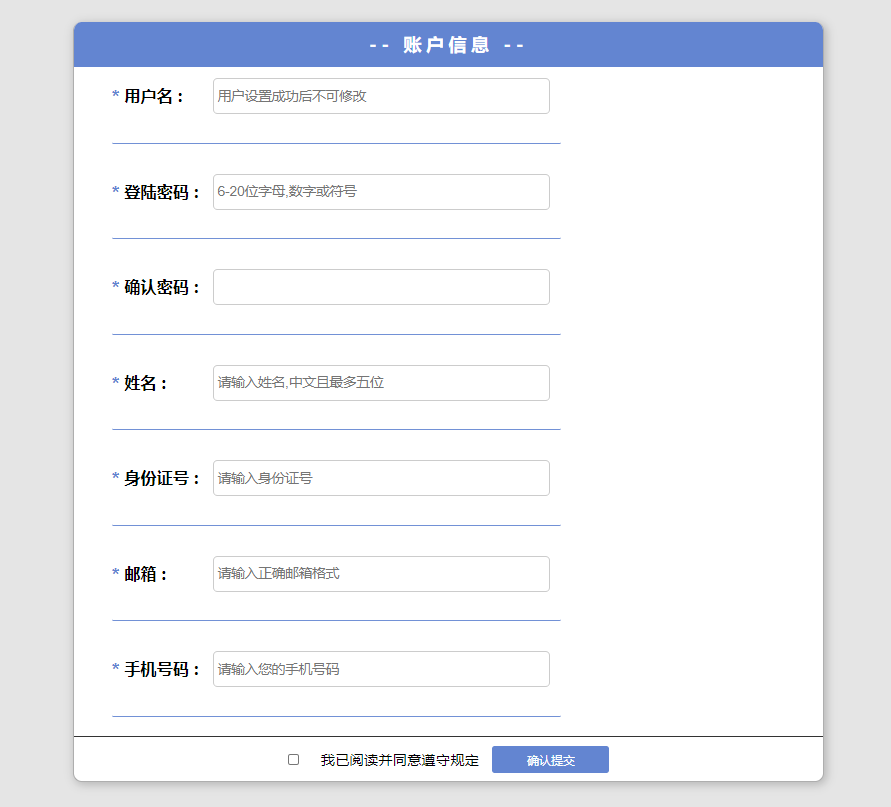
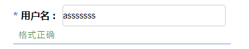

数据有效性验证

1. html4的时期，通过js脚本验证表单元素
2. html5中，有些表单控件自带了一些验证属性



以用户名验证为例

```html
<div>
    <div class="item">
      <span class="important">*</span>
      <label for="userAccount">用户名 :</label>
      <input type="text" id="userAccount" placeholder=" 用户设置成功后不可修改">
    </div>
    <p class="item_"></p>
    <br>
</div>
```

如何设置校验？

```js
/**
 * 表单验证
 */

 var userAccount =  document.getElementById("userAccount");
 
 var test1 = "false";//用户名称格式正确 true

 var items = document.querySelectorAll(".item_");//获取所有提示元素的下标


 var reg = /正则/;
 //当鼠标离开用户名输入框时，产生验证
 userAccount.onblur = function(){ //验证用户名
   var reg = /^\w{6,18}$/;
   if(this.value == ""){
     items[0].innerHTML = "用户名称不能为空";  
     items[0].style.color = "red";
   }else{
     if(!reg.exec(userAccount.value)){
       items[0].innerHTML = "请输入6-18位数字，字母，_";
       items[0].style.color = "red";
     }else{
       items[0].innerHTML = "格式正确";
       items[0].style.color = "green";
       test1 = true;
     }
   }
 }
```

效果：


