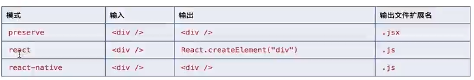
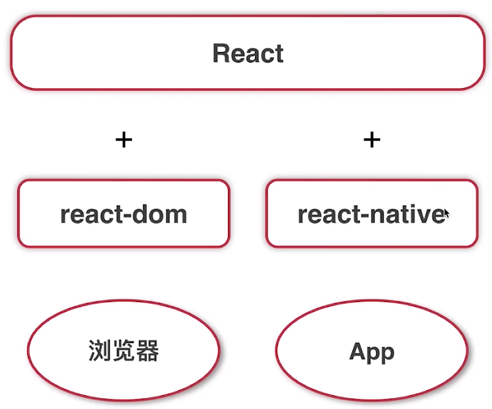
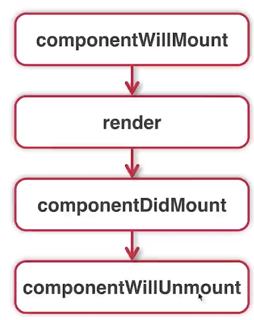
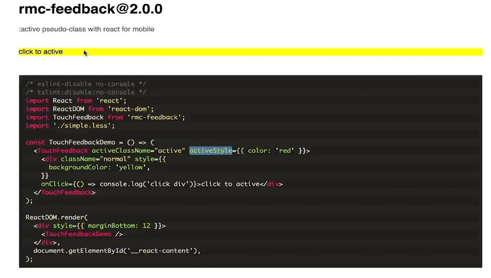

# 当React遇上TypeScript开发Antd组件

> 原视频链接：https://www.imooc.com/video/21447

# ch1 介绍

**课程收获**

* 深度张悟react+ts的知识点
* 学习antd的源码，借鉴高手的代码风格
* 前端造轮子技能+5
* ....

**课程内容**

* ts的配置
* 泛型
* reactdom
* react常用组件
* antd中modal组件开发

# ch2 TypeScript配置

`tsc --init`生成ts配置文件 tsconfig.json

## strictNullChecks配置

```json
"strictNullChecks": true,    
```

严格空类型检测（ts不允许使用一个未赋值的变量）

**注：**

如果需要声明一个变量，既可以是number又可以是空或其他类型

* 使用 | 

  ```typescript
  let weight :number|undefined
  weight = undefines
  ```

* 使用？

  ```typescript
  // ? 相等于 string|undefined
  function getPeople(name?:string){
  	return name || ''
  }
  getPeople('zhangsan')
  getPeople(undefined)
  getPeople(null)
  ```

* 使用any(不建议)

  ```typescript
  let school:any
  ```

**总结**

* undefined和null两个空类型的设计， 使用上不方便
* 通过strcitNullChecks严格校验类型，让代码更安全

## moduleResolution配置

```json
"moduleResolution": "node",                 
/* Specify module resolution strategy: 'node' (Node.js) or 'classic' (TypeScript pre-1.6). */
```

* node模式：在node modules中查找

* classic模式（适用于老项目）： 先在外部文件中查找，再去node modules中查找，再去父目录（一直向上层查找）

## jsx配置

1. 后缀名：index.tsx
2. 配置jsx：

```json
"jsx": "preserve",                           
/* Specify JSX code generation: 'preserve', 'react-native', 'react', 'react-jsx' or 'react-jsxdev'. */
```



## esModuleInterop配置

自动处理ts中缺省导入导出的问题。

```json
"esModuleInterop": true,                        
/* Enables emit interoperability between CommonJS and ES Modules via creation of namespace objects for all imports. Implies 
```

导出方式：

* module.exports
* exports

## noImplicitAny配置

类型检测相关配置中的一种，true表示不能在代码中出现隐式的any类型

```json
"noImplicitAny": true,                       
/* Raise error on expressions and declarations with an implied 'any' type. */
```

## target配置

经过编译后生成什么版本的js代码

```json
 "target": "es5",                                
/* Specify ECMAScript target version: 'ES3' (default), 'ES5', 'ES2015', 'ES2016', 'ES2017', 'ES2018', 'ES2019', 'ES2020', or 'ESNEXT'. */
```

# ch3 TypeScript泛型

## 泛型接口

```typescript
function add<T>(arg1:T,arg2:T){
  return arg1+arg2;
}

//<T>(arg1:T,arg2:T) => T
//let addFunc:<T>(arg1:T,arg2:T) => T
//let addFunc2:{<T>(arg1:T,arg2:T) :T}

//泛型接口
//第一种写法
interface GenAdder {<T>(arg1:T,arg2:T) :T}

let addFunc:GenAdder

addFunc = add;

addFunc<number>(1,2)
addFunc<string>('1','2')

//第二种写法
interface GenAdder2 <T>{(arg1:T,arg2:T) :T}

let addFunc2:GenAdder2<string>

addFunc2 = add;

addFunc2('1','2')
```

## 泛型类

```typescript
//泛型类
class Adder {
  add:<T>(arg1:T,arg2:T) => T;
}

const adder = new Adder();
adder.add = function add<T>(arg1:T,arg2:T){
  return arg1+arg2;
}


//泛型类
class Adder2<T>{
  add:(arg1:T,arg2:T) => T;
}
function add(arg1,arg2){
  return arg1+arg2;
}

const adder2 = new Adder2<number>();
adder2.add = add
adder2.add(1,2);

const stringAdder = new Adder2<string>();
stringAdder.add = add;
stringAdder.add('1','2');
```

## 泛型约束

对函数参数进行校验和约束

```typescript
//eg1 泛型约束
//定义一个接口约束类型变量T
interface ILength{
  length:number
}

//T必须有length属性
function getLength<T extends ILength>(arg:T):T{
  console.log(arg.length);
  return arg;
}

//getLength<boolean>(false) //报错boolean属性无length属性
getLength<string>('xiaozhang')

```

```typescript
//eg2 利用keyof取出类型变量T中的所有属性，得到联合类型
function getProperty<T,K extends keyof T>(obj:T,key:K){
  return obj[key];
}

//注：keyof用来获得对象中的属性，返回一个联合类型
const people = {name:'xiaozhang',age:16}
let keys:keyof typeof people

getProperty(people,'name');
// getProperty(people,'names');//报错 people无names属性
```

# ch4 reactDom



## render()

```tsx
//               组件       挂载到哪里
ReactDOM.render(<App/>,document.getElementById('root'),()=>{
    //组件挂载之后做的事情，这里是回调函数,说明render也是一个异步函数
})
```

**render函数的渲染机制：**

react16之前用的是Stack（因为比对非常耗时，比对前不会更新界面，所以渲染时会有卡顿等问题），之后是Fiber更新机制（渲染流畅度更好，Fiber把比对进行拆分，每做完一个小任务就更新部分页面，使得更新频率比较快）

## unmountComponentAtNode()

组件卸载

```tsx
ReactDOM.render(
    <App />,document.getElementById('root'),()=>{
      setTimeout(()=>{
        //(document.getElementById('root') as HTMLElement).firstChild as HTMLElement).remove(); 
        ReactDOM.unmountComponentAtNode(document.getElementById('root') as HTMLElement)
      },3000)
    }
);
```



## findDomNode()

通过ref拿到组件对象，通过findDOMNode拿到组件对应的真实DOM节点

```jsx
let app:any
ReactDom.render(<App ref={node=>app=node}/>,document.getElementById('root'){
    console.log(app);
    console.log(ReactDOM.findDONNode(app))
});
```

## createProtal()

把子组件渲染到父组件层级之外的DOM元素里，同时在事件处理时又能被当作父组件的子组件来处理

```react
ReactDom.createProtal(<button>click</button>mdocuement.getElementById('protal'))
```

注：protal的方式来挂载也会触发父组件的事件

应用场景：model弹框中，下面例子

# ch5 antd基础组件

**rmc-feedback基础组件**



**rmc-dialog基础组件**

antd中dialog的一个基础，antd是它的一个加强和美化

**classnames**


# ch6 antd组件的实现

## alert弹框实现


一些注意的点：

* 复用alert弹框样式：`import Modal from 'antd-mobile/lib/modal/index.js'`
* index.html通过设置viewport里面的user-scalebale来禁止用户缩放
* 解决页面滚动问题：  `document.body.removeEventListener('touchmove',stopMove)`

## **operation弹框实现**


## promp弹框实现


](https://www.imooc.com/video/21318)