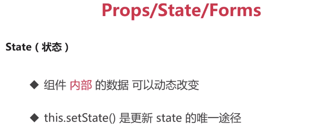

# 基于实例的React16教程

> 原视频链接：https://www.imooc.com/video/17893

## 1. React一些知识回顾

**Jsx**

* jsx只是一个语法糖，本质是`React.createElement`语法。
* 是一个ReactELmenet对象（如图下）

**在React项目中使用bootstarp**

1. `npm install bootstrap --save`
2. 在index.js中引入`import 'bootstrap/dist/css/bootstrap.min.css'`

 **React属性**

**React生命周期**

也可以通过受控组件ref直接获取DOM

## 2. 综合实例 - 留言板

**React开发思想以及和其他思想的异同**

* **状态提升（lifting state up）：**将共享的状态提升到它们最近的父组件中进行管理
* **自上而下的数据流(top down data flow)**：react中，数据是通过props来进行由上而下的数据传递的
* 和双向绑定区别：单向数据流要写回调函数，比双向绑定要写更多的模板代码

## 3. context

在一个典型的react应用中，数据是通过props属性由上而下进行传递的，但是对于某些全局类型的属性而言非常繁琐，比如语言 ：中午or英文，主题：浅色or深色，这些属性是应用中许多属性都需要的

代码在demo-themechange中

