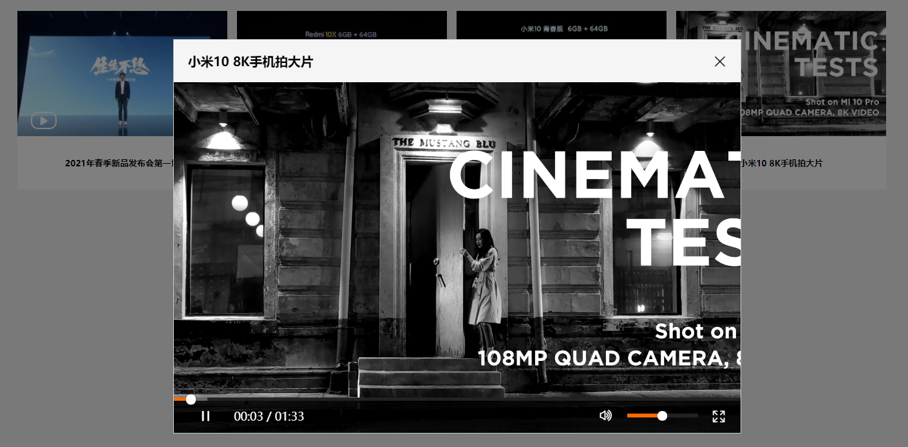
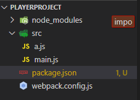
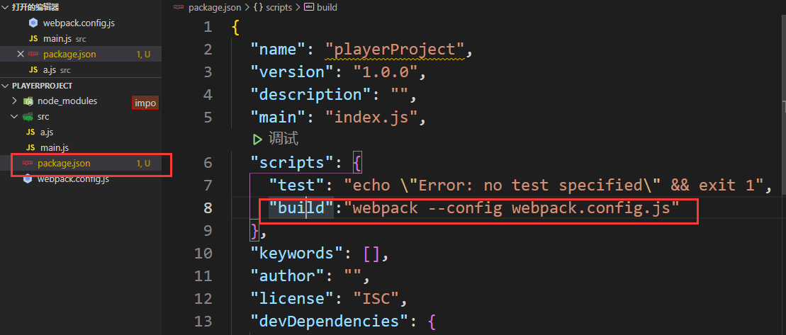
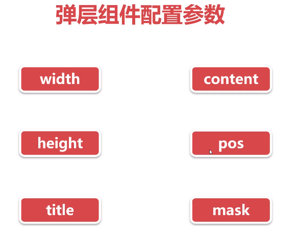
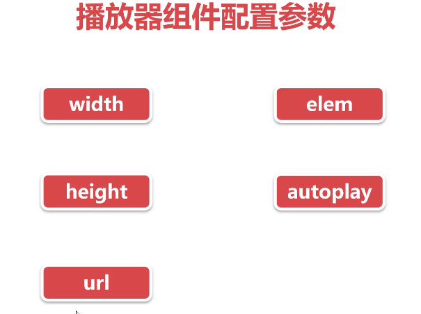
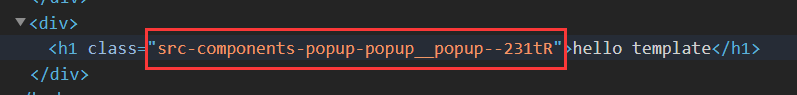

# TypeScirpt组件化实现弹窗播放器

原教程链接：https://www.imooc.com/video/21619

# 1. 效果展示




# 2. Webpack搭建项目环境

**ts的一些优点**

* 静态类型检查，可以规范编码的方式，让项目见状成长
* 相比于ts，开发阶段更耗时，但开发需求更方便

**为什么使用webpack工具？**

* ts编写的文件不能直接在浏览器中运行，需要转换成浏览器识别的js文件
* 每一个独立的文件可以看作是一个模块
* 提高开发效率，即工程化项目

## 2.1 初始项目

```
npm init -y
cnpm i -D webpack webpack-cli
//-D局部安装，-g表示这个计算机中的所有webpack都是一个版本
```

构建项目目录



新建文件 webpack.config.js

```js

const path = require('path');

module.exports = {
  entry:"./src/main.js",
  output:{
    path:path.resolve(__dirname,'dist'),
    filename:"main.js"
  },
  mode:"development"
}
```

因为webpack是局部安装，所以不能直接用命令行，要配置自己的命令



```
npm run build
```

## 2.2 安装插件

然后安装其他插件，如下

* 支持css：style-loader，css-loader

* 支持html：html-webpack-plugin

* 其他：clean-webpack-plugin(清理dist之前被误操作的文件)

* 热更新：webpack-dev-server

* 支持字体图标：iconfont 下载file-loader

* 支持ts：

  * 安装ts-lader和typescript

  * webpack.config.js修改入口文件：` entry:"./src/main.ts",`

  * 为了让`import a from './a'`表示引入的是a.ts而不是a.js（webpack默认），在webpack.config.js中添加

    ```json
      resolve:{
        "extensions":['.ts','.js','.json']//省略后缀名，注意顺序
      },
    ```


# 3. 需求分析

**需求分析**

弹层组件包括：popup.ts、popup.css

播放器组件包括:video.ts video.css





# 4. 组件开发

**结构搭建**

可以给li添加自定义属性data-url和data-title

```html
<li data-url="https://cdn.cnbj1.fds.api.mi-img.com/mi-mall/812358b69886e576c66a01f1f00affe9.mp4" data-title="小米10 青春版 发布会"></li>
```

通过`dataset.url和dataset.title`就可以获取

```ts
let listItem = document.querySelectorAll('#list li');

for(let i=0;i<listItem.length;i++){
  listItem[i].addEventListener('click',function(){

    let url = this.dataset.url;
    let title = this.dataset.title;

    console.log("对应视频信息",url,title);
    
  })
}
```


## 4-1 设计组件的相关方法

**组件的创建和配置**

定义接口需要哪些方法，哪些属性。方便多人协作

```typescript
//组件配置接口
interface Ipopup{
  width?:string;//?表示可选
  height?:string;
  title?:string;
  pos?:string;
  mask?:boolean;//遮罩层
  content?:()=>void;
}

//组件接口
interface IComponent{
  tempContainer:HTMLElement;
  init:()=>void;
  template:()=>void;
  handle:()=>void;

}

function popup(options:Ipopup){
  return new Popup(options);
}

class Popup implements IComponent{
  tempContainer;
  constructor(private settings:Ipopup){
    this.settings = Object.assign({
      width:'100%',
      height:'100%',
      title:'',
      pos:'center',
      mask:true,
      content:function(){}
    },this.settings);
    this.init();
  }
  //初始化
  init(){
    this.template();
  }
  //创建模板
  template(){
    this.tempContainer = document.createElement('div');
    this.tempContainer.innerHTML = `
      <h1>hello template</h1>
    `;
    document.body.appendChild(this.tempContainer);
  }
  //事件操作
  handle(){

  }
}

export default popup;
```

使用组件时

```typescript
popup({});
```

## 4-2 模块化CSS方式

`// import './popup.css' `直接import是全局引入css操作，容易造成同名冲突。

**如何模块化引入css？**

首先`webpack.config.js`中

```js
module:{
    rules:[
      //全局样式
      {
        test:/\.css$/,
        use:['style-loader','css-loader'],
        exclude:[
          path.resolve(__dirname,'src/components')//排除掉的文件
        ]
      },
      //局部样式模块化
      {
        test:/\.css$/,
        use:['style-loader',{
          loader:'css-loader',
          options:{
            modules: {
              localIdentName: "[path][name]__[local]--[hash:base64:5]",//生成class语义化
            },
          }
        }],
        include:[
          path.resolve(__dirname,'src/components')//模块化的css
        ]
      },
    ]
  },
```

引入时用require引入

```typescript
let styles = require('./popup.css')//局部模块化引入

//使用
    this.tempContainer.innerHTML = `
      <h1 class="${styles.default.popup}">hello template</h1>
    `;
    document.body.appendChild(this.tempContainer);
```

观察得知webpack自动为其生成唯一名称的class



## 4.3 `<video>`相关API

类型：HTMLVideoElement

属性：

* `duration`
* `currentTime`
* `volume`
* `buffered.end(0)`

方法:  

* `play()`
* `pause()`
* `requestFullscreen()`

# 5. 打包与上线

两个配置文件：webpack.config.dev.js和webpack.config.prod.js

**webpack.config.prod.js的不同**

* 为了打包css，生成独立的main.css。安装`mini-css-extract-plugin`插件
* 给字体文件等 添加`options:{ outputpath:'iconfont'}`

之后就可以直接部署到服务器上等